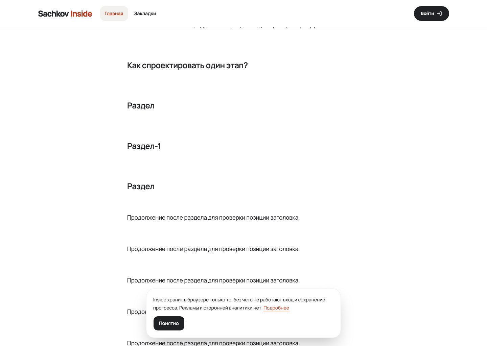
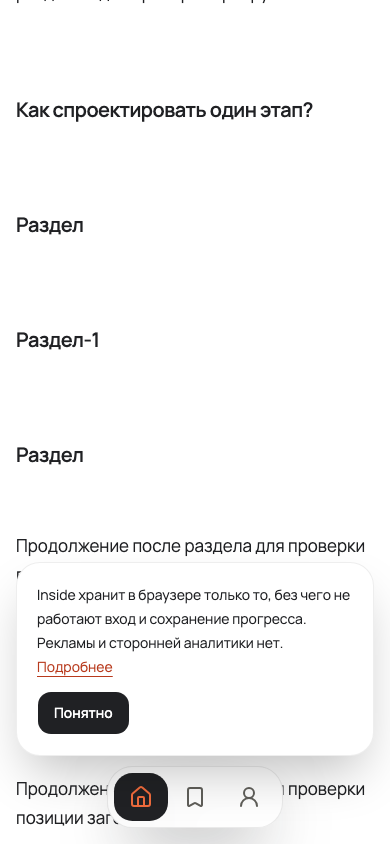

# Source anchors — #1179

Evidence recorded on 2026-10-08 in the #1179 worktree. No production import or release.
Real chapter transfer and author acceptance belong to Content #56.

## Integrated Material and Task c proof

After #1194 landed in main (`e4790866`), the shared `MaterialBodyView` allocated source anchors for
both Reader and Task c. One document owns allocation across nested blocks. The source algorithm
matches Content commit `3deeba8d6cfe48e40184cde6bfd34e6b65802ce2`: lowercase visible text,
punctuation removal, Unicode letters/numbers, underscores, hyphens, and occupied-suffix handling.

The canonical `seedFullStackTaskC` imported a synthetic v2 package through `syncLocal` and the real
authoring API. The package required `task-c-v2` and `github-anchors-v1`. Link-map keys retained
fragments, as the Content export contract requires. The check used owned PostgreSQL/object storage
and a fresh disposable database. The production Web build used ports 4496/4497/4498; authentication
used the repository's synthetic identity fixture.

The focused `pnpm smoke:fullstack` run (`FULLSTACK_TEST_GREP='1179|1194'`) passed all four tests:
source navigation and the existing Task c asset/advice/access checks on desktop and mobile.
The permanent navigation regression is `apps/web/test/fullstack/source-anchors.spec.ts`.

| Observation | Result |
| --- | --- |
| Task to Material with a fragment | `#раздел-2` opens the third heading in `Раздел`, `Раздел-1`, `Раздел` |
| Material to Task c with a fragment | The Unicode source heading opens after destination navigation |
| Task same-page link and repeated click | Both native clicks open the same source heading |
| Desktop, width 1440 | Heading top 177.3 px; container top 81 px; offset about 96 px; container scroll 2188; window scroll 0 |
| Mobile, width 390 | Heading top 95.7 px; document scroll 2782; container scroll 0 |
| Unknown Task fragment | Document and application container both return to scroll position 0; Task title is in the viewport |
| Source IDs | Every document ID is unique; Unicode and occupied duplicate suffixes are preserved |
| Responsive/accessibility | No horizontal overflow; the full-main axe scan reports no serious or critical violations |
| Existing Task c behavior | Keyboard advice, imported image/link, programme order and denied protected asset remain verified |

## Reader and collision regressions

A fresh production build passed eight native Reader navigation tests on desktop and mobile:
streamed cross-page arrival, same-page/repeated clicks, legacy aliases, unknown-fragment fallback
and a heading named Content. The last case failed before the application shell address changed
from `content` to `app:content`; container lookup now uses `data-application-content`.

The owner chose Content source priority on 2026-10-08 when `material-section-0` also names a legacy
alias for another heading. `SourceAnchorLegacyCollision` verifies one unique source target and
scrolling to that heading. Non-colliding legacy aliases remain valid. Reader metadata and Task
service sections also keep distinct IDs and correct accessible labels when a source name conflicts.

The navigation marker follows the blocks, preserving `first:mt-0`. Shared navigation opens enclosing
`details` for a target and resets scrolling ancestors for an unknown fragment. Existing targets
outside the document body remain addressable.

The focused suite passed 48 Reader/Task/body stories, 15 whole-page screenshot browser-engine tests
and 10 package-v2 tests. Five Storybook MCP source-anchor scenarios passed with accessibility checks.

## Initial Material-only import proof

The earlier v1 synthetic package passed `pnpm authoring:sync-local` through an isolated real API.
It checked cross-page Unicode links, duplicate suffixes, a same-page keyboard link and unknown
fragments. Local `#fragment` links initially failed body validation as `unsafe_link`; backend and
importer regression tests retain this case.

[Imported Reader on mobile](imported-reader-mobile.png), [Reader desktop](storybook-desktop.png),
[Reader mobile](storybook-mobile.png).

Initial `pnpm check` passed on `dda846ba`. Final aggregate verification, independent review and CI
are recorded in [PR #1221](https://github.com/sachkov-inside/platform/pull/1221).

## Independent review outcomes

[Standards](review-standards.md) and [Spec](review-spec.md) completed the second pass on `06b42f5e`.
The first placement finding was fixed by shared navigation and real Reader/Task consumers.
The outline traversal smell was rejected with the baseline filter as evidence: outline and
source-anchor allocation intentionally cover different blocks. The source/legacy conflict was
resolved by the owner's source-priority decision and a regression story.

Second-pass Standards P3 was fixed: documentation now uses the actual 64rem scrolling breakpoint.
Second-pass Spec reported no findings. Every finding has an outcome; no findings were deferred.
