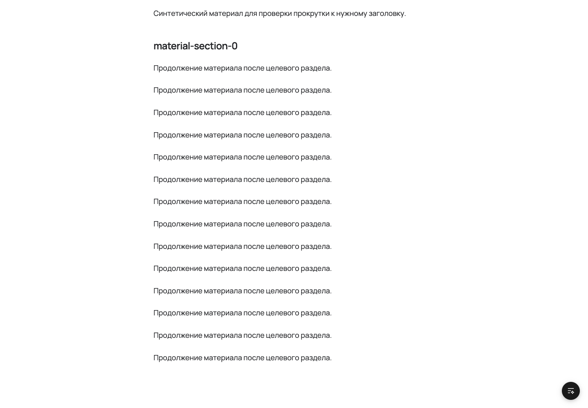

# Source anchors — #1179

Local evidence recorded 2026-10-08 on the #1179 worktree. No production import or release.

The synthetic package went through `pnpm authoring:sync-local` into an isolated real backend,
PostgreSQL and object storage. Two free Materials were published in that disposable local database.
The source page linked to `target.md#как-спроектировать-один-этап`, `target.md#раздел-2` and an unknown
fragment. It also contained `#свой-раздел` on the same page. Local `#fragment` links initially failed
backend validation with `unsafe_link`; the MaterialBody acceptance test records that regression.

| Observation | Evidence |
| --- | --- |
| Native cross-page click, mobile width 390 | Heading top 96.45 px; no horizontal overflow; [imported Reader](imported-reader-mobile.png) |
| Duplicate/collision allocation, desktop width 1440 | Reader ids: `раздел`, `раздел-1`, `раздел-2`, `раздел-3`; `#раздел-2` heading top 96.09 px; desktop `#content.scrollTop` 2326 |
| Unknown fragment, desktop | Document and `#content` both at scroll position 0; Material title visible |
| Keyboard same-page link | Focus link «Здесь», press Enter; `#свой-раздел` became the URL fragment and the heading remained visible |
| Storybook shared production Reader | [Desktop](storybook-desktop.png), [mobile](storybook-mobile.png) |
| Scoped WCAG scan of live Reader body | axe: no violations for `wcag2a`, `wcag2aa`, `wcag21a`, `wcag21aa`; this was a body-only scan |

The permanent regression suite is `apps/web/test/navigation/source-anchors.spec.ts` on a production
Web build with the navigation backend double. It exercises native cross-page and same-page clicks,
legacy fragments and unknown-fragment fallback. Import and MaterialBody tests own conversion and
validation. Storybook uses a fragment click adapter because Vitest supplies a base URL to its
iframe; the production navigation tests exercise unadapted links.

Task c integration and the final aggregate checks will be recorded after #1194 lands. Real chapter
transfer and author acceptance belong to Content #56.

## Source/legacy collision decision

On 2026-10-08 the owner chose the Content source anchor when `material-section-0` also names a
legacy alias for another heading. `SourceAnchorLegacyCollision` verifies one unique target and
scrolling to the source heading. Non-colliding legacy aliases remain valid.

Initial full `pnpm check` passed with exit 0 on `dda846ba`; final integrated-head check is pending.

Storybook MCP passed all four source-anchor scenarios with accessibility checks. The desktop
collision target sits at 95.7 px and its ID appears once.

The fragment marker follows the body blocks, preserving `first:mt-0`. A live check confirmed
`0px` before the first heading and 95.7 px for the collision target. All 32 Reader stories and the
four MCP accessibility scenarios passed after that correction.

Fragment navigation lives in shared UI and resets scrolling ancestors without a shell ID.
Existing targets outside the body remain addressable. The fresh production build passed all six
Reader navigation tests on desktop and mobile after the move.
