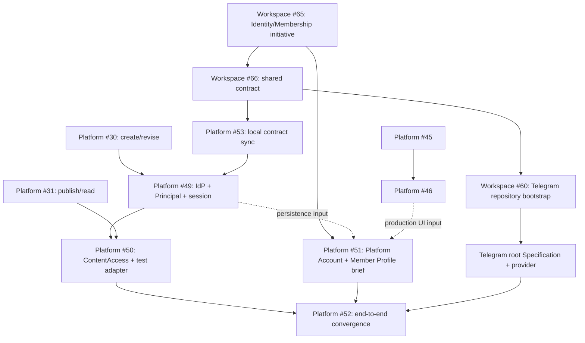

# Platform v1 application specification

Статус: подтверждённый repository-local contract для
[Platform #16](https://github.com/sachkov-inside/platform/issues/16), дополненный принятыми
[Platform #27](https://github.com/sachkov-inside/platform/issues/27) engineering decisions и
[Platform #58](https://github.com/sachkov-inside/platform/issues/58) Materials boundary decision,
[Platform #19](https://github.com/sachkov-inside/platform/issues/19) parallel UI laboratory и
production frontend integration, а также отдельным
[Platform #48](https://github.com/sachkov-inside/platform/issues/48) Identity, Platform Account и
Member Profile track.

Дата: 2026-08-23.

## Результат и authority

Platform v1 является каноническим домом материалов Inside. Автор вручную создаёт и публикует
материалы; публичный посетитель находит и читает открытый контент; участник управляет private
Platform Account и отдельным Member Profile, связывает Platform Account с Telegram и получает
закрытый контент, пока состоит в каноническом закрытом chat.

Этот документ владеет application contract: capability modules, logical model, flows,
application-level NFR, порядком production foundations и ADR inputs. Продуктовая граница остаётся в
[MVP brief](../product/platform-mvp-brief.md), а канонические термины — в [`CONTEXT.md`](../../CONTEXT.md).
Код, tests и возможные application ADR принадлежат этому repository.

Specification синхронизирует принятую cross-repository
[Workspace #40](https://github.com/sachkov-inside/workspace/issues/40), отдельную
[Identity/Membership initiative #65](https://github.com/sachkov-inside/workspace/issues/65) и
завершённую [contract sync #66](https://github.com/sachkov-inside/workspace/issues/66). Workspace
links ниже являются authority provenance, но build, test, runtime и agent work не читают соседний
checkout или Workspace.

## Application boundaries

MVP brief задаёт product scope; здесь зафиксированы только его Platform-owned implementation
consequences:

- Material и его revisions являются единственным canonical content write/read path;
- актуальные Materials создаются вручную, поэтому application model не содержит Telegram source
  identity, import mapping, migration pipeline, deduplication или loss report;
- material-specific Telegram discussion relation не является обязательным полем или application
  invariant;
- admin, REST и MCP используют одни commands, validation, conflicts и publish policy;
- один provider-neutral `ContentAccess` является final Platform authority для read, preview,
  asset/download и video access, а `MembershipEntitlements` только строит bounded Platform grant
  из принятого evidence;
- Identity Provider доказывает External Identity, но только Platform сопоставляет её с Principal,
  создаёт Platform Session и решает permissions/content access;
- private Platform Account не является member-visible projection, а Member Profile не является
  identity, Membership или authorization input;
- Member Profile доступен только active members; anonymous visitor, non-member и crawler не
  получают projection или sensitive Platform Account/identity/link/evidence/security data;
- PostgreSQL projections обеспечивают Library, Topic/Series navigation, search и related Materials;
- ReadingState не участвует в access decision и сохраняется при окончании Membership;
- owner-controlled Tribute URL является только outbound acquisition destination: Platform не
  интегрируется с Tribute API/webhooks и не использует click/payment state как MembershipEvidence.

Identity provider, отдельная Telegram application и Kinescope являются внешними seams Platform;
их provider types и credentials не входят в application modules. Production frontend развивается
в одном существующем `apps/web` по
[Platform #19](https://github.com/sachkov-inside/platform/issues/19). Завершённая
[#36](https://github.com/sachkov-inside/platform/issues/36) создала App Router/FSD foundation,
server-only backend connection seam, layouts/routes/navigation и временную visual заглушку, но не
reusable visual baseline. [#45](https://github.com/sachkov-inside/platform/issues/45) создаёт внутри
этого приложения отдельно mergeable, development-only UI laboratory; она владеет stories, typed
presentation fixtures, components и semantic tokens, но не production routes, application data или
business rules. [#46](https://github.com/sachkov-inside/platform/issues/46) применяет принятый UI к
production shell, а #37–#39 соединяют те же client-safe presentation interfaces с реальными
application interfaces своих capabilities.

Backend/headless capabilities и UI laboratory могут развиваться параллельно. Laboratory fixtures
типизированы presentation props/view-model contracts и выражают representative состояния без fake
API, client или backend; production routes не импортируют fixture modules или workshop runtime.
Один server-only backend seam остаётся единственным data path. UX brief #20 и owner-taste brief #21
остаются inputs, но отменённые concept gate
[#22](https://github.com/sachkov-inside/platform/issues/22#issuecomment-5379019538), standalone
component proof [#23](https://github.com/sachkov-inside/platform/issues/23#issuecomment-5379019592)
и superseded design lane [#40](https://github.com/sachkov-inside/platform/issues/40#issuecomment-5382373045)
остаются закрытой provenance и не являются текущими dependencies.

## Production baseline и provisional choices

Эти choices являются стартовым production path, а не invitation к повторному comparison или
throwaway prototype:

| Concern | Application contract |
|---|---|
| Runtime/tooling | Node.js 24 LTS, strict TypeScript, pnpm и exact lockfile |
| Web | Next.js App Router + React |
| Backend | один NestJS + Fastify codebase с thin `api`, `worker` и `mcp` entrypoints |
| Application contract | REST + OpenAPI; transports не владеют application rules |
| Transactional store | PostgreSQL 18 |
| Data access | Kysely + `pg`, checked-in migrations as authority и generated DB types |
| Jobs | `pg-boss`; product queue появляется только вместе с первым durable job |
| Search | PostgreSQL FTS с bounded RU/EN normalization и ranking fixtures |
| Content document | versioned ProseMirror JSON, Tiptap adapter, immutable revisions, safe renderer и semantic commands |
| Video | Kinescope за application-owned authorization adapter |

[Platform #17](https://github.com/sachkov-inside/platform/issues/17) и
[#18](https://github.com/sachkov-inside/platform/issues/18) закрыты как superseded horizontal
foundations. Их scope и acceptance распределены по vertical capability tickets
[#30](https://github.com/sachkov-inside/platform/issues/30),
[#31](https://github.com/sachkov-inside/platform/issues/31),
[#28](https://github.com/sachkov-inside/platform/issues/28) и
[#29](https://github.com/sachkov-inside/platform/issues/29). Отдельных Kysely/Drizzle и
ProseMirror/Portable Text comparison stages нет. Если implementation выявляет конкретный blocker,
owning PR фиксирует evidence и migration impact и предлагает smallest production change; два
параллельных data или document path не поддерживаются.

Identity choice остаётся provisional. Текущая application target — Logto OSS с email code,
branded redirect, Next BFF и Nest JWT; Better Auth является fallback при провале UX/protocol proof.
Provider не считается принятым только на основании этой specification: сначала нужны application
proof и отдельное owner decision, а hard-to-reverse trade-off при необходимости фиксируется в
Platform ADR.

## Engineering organization and write contract

[Platform #27 owner decision](https://github.com/sachkov-inside/platform/issues/27#issuecomment-5378336463)
зафиксировал следующие normative implementation decisions. Их primary-source evidence, comparison
и rationale находятся в [#27 research artifact](../research/platform-v1-engineering-contract.md),
но authority остаётся в этой specification.

### Frontend organization

- Next.js-owned `app/` остаётся единственным App Router route/runtime tree.
- Full Feature-Sliced Design адаптируется под App Router в `src/_app`, `src/_pages`, `src/widgets`,
  `src/features`, `src/entities` и `src/shared`.
- Layer или slice создаётся только вместе с реальным code; пустой speculative scaffold не нужен.
- Imports следуют FSD layer direction и slice public interfaces. Server-only и client-safe public
  interfaces разделены; client graph не импортирует server-only implementation.
- UI laboratory остаётся development-only entry внутри `apps/web`: stories используют те же
  client-safe component public interfaces, что будущие Server Components, а typed presentation
  fixtures не импортируются production routes и не образуют alternate data layer.
- Component или token module появляется только вместе с bounded story/reference consumer и затем
  получает отдельный production adoption point; laboratory не создаёт второй route tree, frontend
  application или FSD hierarchy.
- FSD применяется только на frontend. Backend не копирует FSD layers.

### Backend modules и application interface

- Один `apps/backend` остаётся modular monolith. Capability modules имеют малые public interfaces,
  internal implementations и явно объявленные dependencies; entrypoints остаются thin adapters.
- Platform-owned PostgreSQL pool/Kysely composition, generated types и один migration authority
  принадлежат `infrastructure/postgres`; capability persistence остаётся internal.
- Новый workspace package, process или separately deployable module допустим только после доказанной
  operational/domain seam. Speculative packages и generic layer folders запрещены.
- Один глубокий `Materials` module предоставляет caller-oriented facets `MaterialAuthoring` и
  `PublishedMaterialReader`; generic command bus не вводится. `createMaterials` является одной
  canonical assembly для Nest adapter и acceptance tests.
- Public interface использует domain names без storage suffix: `MaterialBodySnapshot` и
  `RenderedMaterialBody`. Persisted body сохраняет явный schema discriminator, а exact codec names
  могут содержать `V1` внутри implementation.
- Пока production `IdentityPrincipals` owner module не существует и ни один entrypoint не
  импортирует `MaterialsModule`, Nest adapter может принимать временный `AuthorPolicy` через
  dynamic registration. Static module и его composition test появляются вместе с первым реальным
  authorization provider/caller; placeholder/global policy ради декоративного static graph не
  создаётся.

### Validation, results and write atomicity

- Transport adapter проверяет protocol и input shape и сопоставляет trusted identity с
  `PrincipalId`; он не владеет business rules.
- `MaterialAuthoring` владеет permissions, author workflow, metadata policy и координацией reference
  preconditions через public interfaces `IdentityPrincipals`, `Assets` и `Videos`.
- Internal `MaterialBody` module владеет versioned document schema, validation, migration, safe
  render и extraction. Отдельный public `ContentSchema` capability появляется только вместе с
  независимым caller; единственная Tiptap implementation не оборачивается в speculative port.
- PostgreSQL constraints владеют durable uniqueness, foreign keys, revision consistency и финальным
  race arbitration.
- Application operations возвращают discriminated transport-neutral results со stable codes.
  Каждая operation экспортирует только собственный error union.
  REST отображает их в RFC 9457 Problem Details; MCP использует те же codes без HTTP vocabulary.
- Application operation владеет Kysely transaction. `baseRevisionId` реализует optimistic
  compare-and-set; stale base возвращает conflict, blind partial retry и last-write-wins запрещены.
- Idempotency scope — Principal + operation + key. Request fingerprint, stable result/effect и write
  сохраняются в одной transaction; повтор с тем же payload воспроизводит result, другой payload с
  тем же key возвращает mismatch. Caller повторяет uncertain request с тем же key.

### Testing, enforcement and ADR timing

- Pure Material и internal `MaterialBody` rules покрываются unit tests. Application integration tests идут
  через capability public interface и real PostgreSQL; отдельно проверяются migrations,
  constraints, transaction rollback, idempotency и concurrency. Transport adapters имеют thin
  mapping tests; journey E2E добавляются с реальными surfaces.
- По мере появления owning capabilities membership refresh и provider callbacks получают
  concurrency, idempotency, stale-state и failure-path tests в том же repeatable setup.
- Testcontainers PostgreSQL принят как future test lifecycle direction: один container на
  integration run с isolation, сохраняющей real commit/rollback и multiple-connection semantics.
  Exact dependency version и isolation mechanics принадлежат #30 implementation brief.
- Platform-local shared strict TypeScript base, type-aware typescript-eslint, frontend/backend
  import rules и generated DB type drift checks приняты как future enforcement. #27 не добавляет
  dependencies, lint/config/CI rules и не меняет shared harness.
- Для engineering choices #27 не создаёт ADR и отдельные prototype/proof tickets. #30 фиксирует
  exact versions, types, SQL и test isolation в required implementation brief и доказывает их
  retained vertical slice и tests. Focused ADR добавляется в тот же PR только при реально
  обнаруженном hard-to-reverse, non-obvious trade-off.

## Processes и capability modules

| Process | Responsibility | Не владеет |
|---|---|---|
| `web` | SSR/RSC public, member и admin surfaces; BFF session; coarse access states | Membership policy, provider secrets, direct database access |
| `api` | REST/OpenAPI adapters, identity mapping, uploads/callbacks и application commands | route-local domain rules |
| `worker` | durable projection, reconciliation и provider jobs | отдельная domain model или write path |
| `mcp` | authenticated tools/resources поверх application interfaces | SQL, autonomous publish или human Membership identity |

Entry points вызывают одни application use cases и не создают параллельные rule sets.

| Module | Малый interface | Owned facts |
|---|---|---|
| `IdentityPrincipals` | сопоставить trusted external identity/session с local Principal, Subject и permissions | Principal, identity/session mapping, security status и permissions |
| `AccountProfiles` | предоставить private Platform Account и управлять отдельной member-visible Member Profile projection | owner Platform Account projection, Member Profile visibility/content/version |
| `Materials` | `MaterialAuthoring` создаёт, изменяет, проверяет, preview/publish/restore-ит Material; `PublishedMaterialReader` читает exact published revision | revision/publication pointers, author policy, internal body schemas, safe public/search projections |
| `ContentLibrary` | читать projections, search и навигацию, находить related Materials | published projections, ranking и explicit related pins |
| `ContentAccess` | `authorize(Subject, Resource, Action) -> AccessDecision` | provider-neutral policy и reason codes |
| `MembershipEntitlements` | принять MembershipEvidence и построить Platform-owned entitlement | state, validity и refresh coordination |
| `Assets` | начать/finalize upload, связать с revision и ограничить delivery | Asset identity, readiness и immutable resource references |
| `Videos` | upload, status, reconcile, bind и authorize playback | local Video identity и Kinescope mapping/status |
| `ReadingActivity` | idempotently mark read/unread и вернуть recent history | Principal-to-Material reading state; не content access |

Transaction semantics принадлежат единому
[write atomicity contract](#validation-results-and-write-atomicity), а verification seams —
[testing contract](#testing-enforcement-and-adr-timing). External systems получают narrow internal
ports и test adapters. Generic
multi-provider abstraction появляется только со вторым реальным adapter; `ContentAccess` является
provider-neutral потому, что его policy используют несколько delivery callers.
`AccountProfiles` координирует две projections одного human Principal, но Platform Account и Member
Profile имеют независимые authorization и view contracts: ни одна projection не строится из
другой и не разделяет с ней sensitive fields.

## Logical model и cardinalities

Physical tables, indexes и package paths определяются в production implementation. Logical
entities и invariants v1:

| Entity | Cardinality / invariant |
|---|---|
| `Principal` | одна local identity; 0..1 Telegram link; roles и permissions принадлежат Platform |
| `ExternalIdentity` | trusted provider identity принадлежит ровно одному Principal; changeable profile data не является merge key |
| `PlatformAccount` | не более одного private Platform Account на human Principal; identity/security/linking state не публикуется |
| `MemberProfile` | 0..1 member-visible projection на human Principal; active members only; никогда не authorization input |
| `Material` | stable identity и slug; ровно один current draft; 0..1 published revision |
| `MaterialRevision` | immutable full snapshot; принадлежит ровно одному Material |
| `Topic` | Material имеет ровно один Topic; dictionary одноуровневый |
| `Format` | Material имеет ровно один Format; это primary consumption mode, не Asset kind |
| `Tag` | Material имеет 0..N Tags; managed dictionary поддерживает rename/merge без synonyms-duplicates |
| `Series` | имеет 0..N ordered memberships; Material входит в 0..N Series |
| `SeriesMembership` | пара Series/Material уникальна; ordinal уникален внутри Series |
| `Asset` | принадлежит Platform; MaterialRevision ссылается на 0..N Assets |
| `Video` | local identity с одним Kinescope provider mapping; MaterialRevision ссылается на 0..N Videos |
| `ExternalLink` | typed label + normalized URL; MaterialRevision содержит 0..N links |
| `NavigationPage` | editorial content и curated/query links; Roadmap использует эту роль |
| `MembershipEntitlement` | не более одного current `inside_membership` projection на Principal; validity bounded |
| `ReadingState` | не более одного current state на пару Principal/Material |

`MaterialRevision` содержит application-owned versioned document, metadata snapshot и local
Asset/Video references. HTML, React tree, search text, signed URLs, provider tokens и editor state
являются производными или ephemeral.

Topic, Format, Tag и Series создаются по мере реального authoring; результаты аудита служат
fixtures, а не заранее заданной ontology. Для v1 подтверждены роли:

- «Создание Platform Inside» — ordered Series;
- Roadmap — `NavigationPage`;
- Library — generated view над Materials, не отдельная entity или duplicated content store;
- material-specific Telegram discussion relation отсутствует.

Public Material projection содержит title, summary/teaser, taxonomy, Series и safe media metadata,
но не closed body, private object locator или delivery credential. Published body читается только
через exact published revision; draft resource недоступен через обычные read/download/play paths.

## Application flows

### Authoring и publish

1. Admin или MCP вызывает explicit application operation с identifiers, concurrency и idempotency
   inputs из [write atomicity contract](#validation-results-and-write-atomicity).
2. `MaterialAuthoring` проверяет permissions через `IdentityPrincipals`, владеет workflow/metadata
   policy, координирует reference preconditions через `Assets`/`Videos`, делегирует document
   validation/migration во внутренний `MaterialBody` module и сохраняет immutable revision в одной
   transaction.
3. Preview читает explicit revision и использует тот же safe renderer и `ContentAccess`, что
   published delivery.
4. Publish только после recorded owner GO повторяет validation и atomically меняет published
   revision вместе с public/search projections и необходимым durable job fact.
5. Concurrency, idempotency и transport outcomes следуют единому
   [write atomicity contract](#validation-results-and-write-atomicity).

### Public и closed read

1. Public route читает только public projection; free body может быть shared-cacheable.
2. Closed route получает Subject из trusted identity и вызывает `ContentAccess` до загрузки body.
3. Deny возвращает public teaser и coarse state; allow читает exact published revision.
4. Closed body, access decision и delivery credentials имеют `private, no-store`; protected
   speculative prefetch запрещён.

### Sign-in, Platform Account и Member Profile

1. Identity Provider доказывает External Identity; `IdentityPrincipals` сопоставляет trusted
   identity с ровно одним Principal, а Platform Session только переносит authenticated context к
   последующей Platform authorization. Provider roles/claims не дают Membership content access.
2. Human Principal управляет private Platform Account с identity/security, Telegram linking,
   Membership и recovery states. Service Principal не получает human Platform Account, Member
   Profile или Membership.
3. `AccountProfiles` хранит и авторизует Member Profile отдельно от Platform Account. Exact fields,
   avatar, moderation и discoverability утверждаются в
   [#51](https://github.com/sachkov-inside/platform/issues/51) до production implementation.
4. Только active member получает accepted Member Profile projection другого участника. Anonymous,
   non-member и crawler не получают projection; email, Platform/Telegram internal identifiers,
   Telegram username, link/evidence и security/audit state никогда в неё не входят.

### Membership linking и refresh

1. После email-code sign-in Platform предлагает skippable linking; signed-in Principal начинает
   short-lived link transaction сразу, позже из Platform Account или из closed-Material recovery
   flow.
2. Отдельная Telegram application проверяет Telegram identity, uniqueness и Membership в
   каноническом закрытом chat.
3. Platform принимает normalized MembershipEvidence без raw Telegram model по принятому
   [Workspace v1 contract](https://github.com/sachkov-inside/workspace/blob/main/docs/contracts/identity-membership-v1.md)
   и строит собственный entitlement не дольше `validUntil` этого evidence.
4. Первый protected request после expiry выполняет single-flight refresh. Positive
   MembershipEvidence живёт не более пяти минут; confirmed removal denies immediately; outage
   после expiry fails closed.

### Assets, downloads и video

1. `Assets` создаёт immutable upload target, а finalize проверяет type, size и checksum; publish
   допускает только ready resources.
2. Closed asset/download проходит `ContentAccess`; short-lived delivery credential связан с одним
   Subject/Resource/Action и не переживает access decision.
3. `Videos` начинает Kinescope upload, считает webhook только hint и сверяет authoritative provider
   state; publish допускает только ready Video.
4. Playback token и strict authorization callback повторно вызывают `ContentAccess`; mismatch,
   stale entitlement и outage дают deny.

### Search, navigation и related Materials

- publish transaction обновляет search projection из title, summary, body/headings, asset labels и
  current metadata; closed body index остаётся server-side;
- PostgreSQL FTS ранжирует title выше summary/headings, затем taxonomy/body/assets и проверяется на
  bounded representative RU/EN corpus;
- filters появляются только из реально используемых Topic, Format и Series;
- related выдача сочетает metadata score и explicit author pins без AI dependency.

### MCP

- MCP аутентифицируется как отдельный service Principal с explicit author permissions;
- tools вызывают те же semantic commands, validation results и conflicts, что admin;
- read/preview resources проходят `ContentAccess`; service Principal не наследует human Membership;
- publish разделён на prepare/execute с отдельным recorded owner GO; autonomous publish запрещён.

## Application NFR

### Security и privacy

- protected paths fail closed; identity, Telegram и provider role не заменяют Platform authorization;
- private Platform Account и member-visible Member Profile используют разные projections; email,
  provider claims, internal/Telegram identifiers, link/evidence и security/audit state не
  публикуются;
- cookie session использует `Secure`, `HttpOnly` и explicit `SameSite`; mutations проверяют CSRF и Origin;
- issuer, audience и expiry валидируются строго; secrets, tokens и raw sessions не попадают в logs;
- server renderer запрещает raw HTML/MDX, allowlist-ит nodes/URLs и ограничивает document size/depth;
- closed bodies/resources отделены от public projections; protected allow/deny и preview оставляют
  application audit fact только с opaque local IDs.

### SEO

- home, Library, Topic, Series, Roadmap, public cards и free Materials имеют stable canonical URLs,
  server-rendered metadata, sitemap и crawlable internal links;
- closed card может индексироваться, но closed body отсутствует в HTML, RSC, structured data,
  search response и shared cache;
- draft, preview, admin, Platform Account, Member Profile и MCP surfaces имеют `noindex` и не
  входят в sitemap.

### Accessibility и responsive behavior

- critical journeys работают keyboard-only с видимым focus, semantic landmarks/headings,
  accessible names и announced errors;
- editor, tables, code, player, upload progress и access states имеют non-pointer alternatives;
- UI PR содержит mobile/desktop evidence, keyboard + screen-reader smoke и не имеет
  serious/critical findings automated accessibility audit;
- reduced motion, text zoom и narrow viewport не скрывают content или controls.

### Performance и correctness

В repeatable agreed test setup с зафиксированным fixture corpus:

- public server response p95 не выше 800 ms, protected non-video page p95 не выше 1.5 s без
  пользовательского email/Telegram interaction;
- Library search p95 не выше 300 ms на 10 000 Material projections и representative RU/EN set;
- public critical pages укладываются в LCP 2.5 s, INP 200 ms и CLS 0.1 на согласованном mobile profile;
- query plans, pool limits и payload/document limits измеряются до добавления cache/service;
- correctness scenarios из [testing contract](#testing-enforcement-and-adr-timing) входят в
  согласованный fixture corpus и repeatable setup.

## Production foundation order

1. **Local contract:** этот документ, синхронизированный brief и glossary закрывают Platform #16.
2. **Engineering contract:** [#27](https://github.com/sachkov-inside/platform/issues/27) сравнил
   варианты и зафиксировал [engineering organization and write contract](#engineering-organization-and-write-contract).
   [Research artifact](../research/platform-v1-engineering-contract.md) сохраняет evidence и
   rationale; #27 не меняет harness, agent instructions или production code.
3. **Create и revise draft:** [#30](https://github.com/sachkov-inside/platform/issues/30) одним
   production slice добавляет create/load/revise Material, минимальные PostgreSQL/Kysely migrations,
   versioned ProseMirror/Tiptap document path, immutable revisions, metadata, idempotency и conflicts.
   До кода owner утверждает implementation brief с modules/interfaces, file layout, validation flow,
   transaction boundary и tests. До этого решения ticket имеет `ready-for-human`; после approval
   его переводят в `ready-for-agent` перед production implementation.
4. **Validate, preview, publish и read:**
   [#31](https://github.com/sachkov-inside/platform/issues/31) проводит exact revision через safe
   validation/renderer и private preview к owner-approved publish, public/free read, unpublish и
   restore. До кода owner отдельно утверждает lifecycle, projection, transaction и security design;
   readiness так же меняется с `ready-for-human` на `ready-for-agent` только после approval.
5. **Parallel headless consumers:** после #31
   [#28](https://github.com/sachkov-inside/platform/issues/28) поставляет Library/search/navigation,
   а [#29](https://github.com/sachkov-inside/platform/issues/29) — safe agent authoring через thin
   MCP adapter. Они используют принятый engineering contract; новый owner gate нужен только при
   материальном отклонении.
6. **Technical frontend foundation:** завершённая
   [#36](https://github.com/sachkov-inside/platform/issues/36) создала в существующем `apps/web`
   App Router/FSD composition, server-only backend seam, root layouts, routes/navigation
   `Главная / Библиотека / Карта` и проверяемую временную visual заглушку. Эта заглушка не является
   reusable baseline и не определяет visual/component strategy следующих surfaces.
7. **Parallel UI laboratory:** после синхронизации contract в
   [#44](https://github.com/sachkov-inside/platform/issues/44)
   [#45](https://github.com/sachkov-inside/platform/issues/45) создаёт development-only component
   workshop, semantic tokens, bounded component set и typed presentation fixtures внутри
   `apps/web`. Laboratory может идти параллельно #30/#31 и headless consumers #28/#29, не требует
   работающего backend и не создаёт fake API/client. Exact tool и dependencies проходят отдельный
   owner brief; cloud publishing, Chromatic и любые external services требуют отдельного owner
   approval.
8. **Production shell adoption:** после #45
   [#46](https://github.com/sachkov-inside/platform/issues/46) заменяет временную visual заглушку
   #36 принятыми components/tokens в production shell, не меняя routes или backend seam. Workshop
   runtime и fixtures не входят в production graph.
9. **Production frontend surfaces:** [#37](https://github.com/sachkov-inside/platform/issues/37),
   [#38](https://github.com/sachkov-inside/platform/issues/38) и
   [#39](https://github.com/sachkov-inside/platform/issues/39) поставляют Material reader,
   author editor/Preview и Library/search/Topic/Series после #46 и owning backend capabilities.
   Каждый ticket использует принятые UI public interfaces/tokens, соединяет их с реальными
   application interfaces и добавляет только component needs собственного surface; второй UI
   system, fixture data path или browser-owned business rules запрещены. #20/#21 остаются
   structural и owner-taste inputs, а закрытые #22/#23 и superseded #40 — provenance, не gates.
10. **Parallel Identity/Membership track:** отдельная root Specification
   [#48](https://github.com/sachkov-inside/platform/issues/48) владеет Platform identity,
   authorization, private Platform Account и Member Profile delivery. После repository-local sync
   #53
   [#49](https://github.com/sachkov-inside/platform/issues/49) начинается поверх завершённой #30 и
   доказывает External Identity → Principal → Platform Session path параллельно #31 и UI lane.
   [#50](https://github.com/sachkov-inside/platform/issues/50) ждёт #49/#31 и проводит реальные
   protected resources через `ContentAccess` и test Membership adapter. Member Profile brief
   [#51](https://github.com/sachkov-inside/platform/issues/51) может идти сразу параллельно;
   production persistence использует #49, а production UI — принятую #45/#46 foundation.
   Одновременно [Workspace #60](https://github.com/sachkov-inside/workspace/issues/60) может
   bootstrap-ить Telegram provider lane после принятой Workspace initiative #65, versioned
   contract из #66 и своих owner gates: завершённый Platform #50 не является его trigger.
11. **Identity/Membership convergence:**
   [#52](https://github.com/sachkov-inside/platform/issues/52) соединяет независимо готовые
   Platform consumer/Member Profile и Telegram provider implementations через versioned HTTP
   adapter и общий conformance corpus. Platform сохраняет ownership Membership Entitlement и
   каждого final `ContentAccess` decision; integration или provider availability не дают
   production GO.
12. **Feature-complete candidate:** author/MCP, content, Kinescope, private resources, Membership,
   reading activity и UI journeys проходят end-to-end application verification; актуальные
   Materials вручную созданы без import pipeline.

Identity/Membership dependency graph:

Граф задаёт три параллельные линии: content/application, owner-controlled UI и
Identity/Membership consumer/provider. #51 brief и Telegram bootstrap не ждут готовый #49/#50;
реальные persistence/UI и финальная integration сохраняют показанные consumer dependencies.

Текущая application specification не определяет environments, deploy/promotion/rollback,
infrastructure capacity, domains, observability, secrets operations, backup/recovery или production
GO. Отдельная Workspace specification может начаться только после feature-complete candidate, когда
существует измеренный process/data/provider/capacity profile. До этого trigger соответствующие
решения и implementation backlog не создаются.

## ADR inputs

Application ADR создаётся только если production work обнаруживает одновременно hard-to-reverse
choice, неочевидный контекст и реальный trade-off. Возможные inputs, но не обязательные ADR:

- migrations/data authority и transaction seam;
- canonical document schema, revision model, safe renderer и semantic commands;
- identity provider, BFF и token mapping после proof;
- `ContentAccess` placement и conformance surface;
- private Asset delivery mechanism;
- Kinescope upload/reconciliation/strict authorization mechanics;
- UI component/primitives strategy, только если laboratory и production adoption докажут
  hard-to-reverse trade-off; standalone proof #23 не является prerequisite.

## Provenance

- [Platform #48: Identity, Authorization и Member Profile root Specification](https://github.com/sachkov-inside/platform/issues/48)
- [Workspace #65: cross-repository Identity/Membership initiative](https://github.com/sachkov-inside/workspace/issues/65)
- [Workspace #66: accepted Identity/Membership contract sync](https://github.com/sachkov-inside/workspace/issues/66)
- [Workspace Identity/Membership v1 contract](https://github.com/sachkov-inside/workspace/blob/main/docs/contracts/identity-membership-v1.md)
- [Platform #27 owner architecture decisions](https://github.com/sachkov-inside/platform/issues/27#issuecomment-5378336463)
- [Platform #19 integrated frontend owner decision](https://github.com/sachkov-inside/platform/issues/19#issuecomment-5382270492)
- [Platform #44: parallel UI laboratory owner correction](https://github.com/sachkov-inside/platform/issues/44)
- [Platform #22: whole-screen concept gate canceled](https://github.com/sachkov-inside/platform/issues/22#issuecomment-5379019538)
- [Platform #23: standalone component proof canceled](https://github.com/sachkov-inside/platform/issues/23#issuecomment-5379019592)
- [Platform #40: separate design lane superseded](https://github.com/sachkov-inside/platform/issues/40#issuecomment-5382373045)
- [Workspace Platform v1 specification](https://github.com/sachkov-inside/workspace/blob/main/docs/specifications/platform-v1.md)
- [Workspace #39: current publishing audit decisions](https://github.com/sachkov-inside/workspace/issues/39)
- [Workspace #41: Telegram Membership boundary](https://github.com/sachkov-inside/workspace/issues/41)
- [Workspace #42: Kinescope lifecycle](https://github.com/sachkov-inside/workspace/issues/42)
- [Workspace #54: provider-neutral ContentAccess](https://github.com/sachkov-inside/workspace/issues/54)
