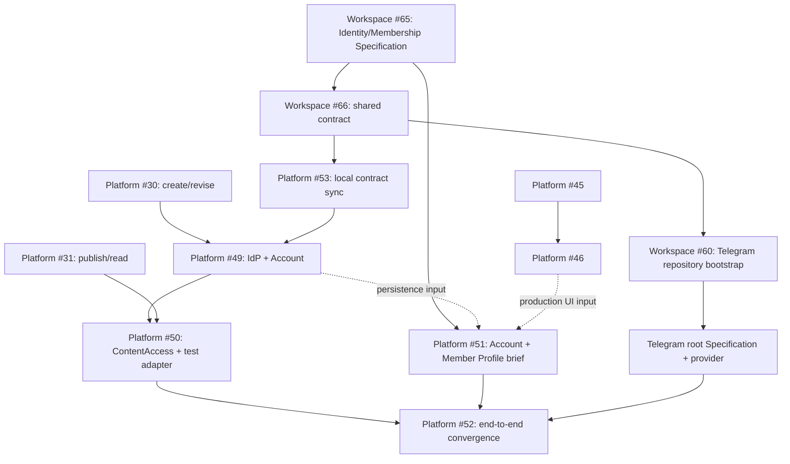

# Platform v1 application specification

Текущий переход Series → Guide и сохранённые wire-имена описаны в
[контракте миграции руководств](guides-migration.md).

Статус: подтверждённый repository-local contract для
[Platform #16](https://github.com/sachkov-inside/platform/issues/16), дополненный принятыми
[Platform #27](https://github.com/sachkov-inside/platform/issues/27) engineering decisions и
[Platform #58](https://github.com/sachkov-inside/platform/issues/58) Materials boundary decision,
[Platform #19](https://github.com/sachkov-inside/platform/issues/19) parallel UI laboratory и
production frontend integration, а также отдельным
[Platform #48](https://github.com/sachkov-inside/platform/issues/48) Identity, Account и
Member Profile track и [Platform #132](https://github.com/sachkov-inside/platform/issues/132)
mutable Material/access decision.

Дата: 2026-09-06.

## Результат и authority

Platform v1 публикует Materials и Series Inside через общий authoring Save по
[контентной границе](../product/platform-mvp-brief.md#контент). Публичный посетитель находит и
читает открытый контент; участник управляет private
Account и отдельным Member Profile, связывает Account с Telegram и получает
закрытый контент, пока состоит в каноническом закрытом chat.

Этот документ владеет application contract: capability modules, logical model, flows,
application-level NFR, порядком production foundations и ADR inputs. Продуктовая граница остаётся в
[MVP brief](../product/platform-mvp-brief.md), а канонические термины — в [`CONTEXT.md`](../../CONTEXT.md).
Код, tests и возможные application ADR принадлежат этому repository.

Текущий delivery scope задан [MVP brief](../product/platform-mvp-brief.md): Materials, Series и
Membership. [Workshop Tracks and Laboratories](workshop-tracks.md) сохраняет отдельный отложенный
контракт. Его модели и существующие foundations не расширяют Series или текущую подписку.

Specification синхронизирует принятую cross-repository
[Workspace #40](https://github.com/sachkov-inside/workspace/issues/40), отдельную
[Identity/Membership Specification #65](https://github.com/sachkov-inside/workspace/issues/65) и
завершённую [contract sync #66](https://github.com/sachkov-inside/workspace/issues/66). Workspace
links ниже являются authority provenance, но build, test, runtime и agent work не читают соседний
checkout или Workspace.

## Application boundaries

MVP brief задаёт product scope; здесь зафиксированы только его Platform-owned implementation
consequences:

- один mutable Material является единственным canonical content write/read path;
- текущая публикация использует Material authoring Save; автоматический importer ещё не реализован.
  Application model не содержит Telegram source identity, import mapping, migration pipeline,
  deduplication или loss report; редакционные оригиналы следуют [content boundary](../product/platform-mvp-brief.md#контент);
- material-specific Telegram discussion relation не является обязательным полем или application
  invariant;
- admin, REST и MCP используют один full-state Save contract, validation и conflict policy;
- один provider-neutral `ContentAccess` является final Platform authority для read, preview,
  asset/download и video access, а `MembershipEntitlements` только строит bounded Platform grant
  из принятого evidence;
- Identity Provider доказывает Logto Identity, но только Platform сопоставляет её с Account и
  решает permissions, Membership и content access;
- private Account не является member-visible projection, а Member Profile не является
  identity, Membership или authorization input;
- Member Profile доступен только active members; anonymous visitor, non-member и crawler не
  получают projection или sensitive Account/identity/link/evidence/security data;
- PostgreSQL projections обеспечивают bounded Home, единый Library catalog, Topic/Series
  navigation и search; Reader не делает related request;
- ReadingState не участвует в access decision и сохраняется при окончании Membership;
- одна Platform-configured Tribute URL является только outbound acquisition destination:
  Platform не интегрируется с Tribute API/webhooks и не использует click/payment state как
  MembershipEvidence.

Identity provider, отдельная Telegram application и Kinescope являются внешними seams Platform;
их provider types и credentials не входят в application modules. Production frontend развивается
в одном существующем `apps/web` по
[Platform #19](https://github.com/sachkov-inside/platform/issues/19). Завершённая
[#36](https://github.com/sachkov-inside/platform/issues/36) создала App Router/FSD foundation,
server-only backend connection seam, layouts/routes/navigation и временную visual заглушку, но не
reusable visual baseline. [#45](https://github.com/sachkov-inside/platform/issues/45) создаёт внутри
этого приложения отдельно mergeable, development-only UI laboratory; она владеет stories, typed
presentation fixtures, components и semantic tokens, но не production routes, application data или
business rules. [#46](https://github.com/sachkov-inside/platform/issues/46) применяет принятый UI к
production shell. Production vertical slices #89, #90, #94 и #95 продвигают принятые
client-safe presentation interfaces в owning FSD modules и соединяют их с реальными application
interfaces без отдельного временного frontend path.

Backend/headless capabilities и UI laboratory могут развиваться параллельно. Laboratory fixtures
типизированы presentation props/view-model contracts и выражают representative состояния без fake
API, client или backend; production routes не импортируют fixture modules или workshop runtime.
Один server-only backend seam остаётся единственным data path. UX brief #20 и owner-taste brief #21
остаются inputs, но отменённые concept gate
[#22](https://github.com/sachkov-inside/platform/issues/22#issuecomment-5379019538), standalone
component proof [#23](https://github.com/sachkov-inside/platform/issues/23#issuecomment-5379019592)
и superseded design lane [#40](https://github.com/sachkov-inside/platform/issues/40#issuecomment-5382373045)
остаются закрытой provenance и не являются текущими dependencies.

## Production baseline и provisional choices

Эти choices являются стартовым production path, а не invitation к повторному comparison или
throwaway prototype:

| Concern | Application contract |
|---|---|
| Runtime/tooling | Node.js 24 LTS, strict TypeScript, pnpm и exact lockfile |
| Web | Next.js App Router + React |
| Backend | один NestJS + Fastify codebase с thin demand-driven process entrypoints; сейчас `api`, `mcp`, capability-specific `material-assets-worker`, `profile-avatars-worker` и `video-deletions-worker` |
| Application contract | REST + OpenAPI; transports не владеют application rules |
| Transactional store | PostgreSQL 18 |
| Data access | Prisma 7 + `@prisma/adapter-pg` — единственный application ORM для всех persistent capabilities; capability-scoped clients ограничивают delegates; checked-in append-only SQL migrations с checksum остаются authority |
| Jobs | `pg-boss`; dependency, capability-specific worker и queue появляются вместе с первым durable job |
| Search | PostgreSQL FTS с bounded RU/EN normalization и ranking fixtures |
| Content document | versioned ProseMirror JSON schema, Tiptap adapter, one mutable Material, safe renderer и full-state Save |
| Video | Kinescope за application-owned authorization adapter |

[Platform #17](https://github.com/sachkov-inside/platform/issues/17) и
[#18](https://github.com/sachkov-inside/platform/issues/18) закрыты как superseded horizontal
foundations. Их scope и acceptance распределены по vertical capability tickets
[#30](https://github.com/sachkov-inside/platform/issues/30),
[#31](https://github.com/sachkov-inside/platform/issues/31),
[#89](https://github.com/sachkov-inside/platform/issues/89),
[#90](https://github.com/sachkov-inside/platform/issues/90),
[#91](https://github.com/sachkov-inside/platform/issues/91),
[#93](https://github.com/sachkov-inside/platform/issues/93) и
[#29](https://github.com/sachkov-inside/platform/issues/29). Отдельных ORM comparison stages и
ProseMirror/Portable Text comparison stages нет. Если implementation выявляет конкретный blocker,
owning PR фиксирует evidence и migration impact и предлагает smallest production change; два
параллельных data или document path не поддерживаются.

Owner выбрал Logto OSS как единственный application proof target; Better Auth исключён и не
остаётся fallback. Target использует отдельные Logto deployable/database/migration authority,
owner-maintained Experience UI fork и external email connector. Browser проходит authorization
code flow со state + S256 PKCE без nonce; BFF хранит provider context только в official
`@logto/next` cookie и предъявляет Nest Logto access JWT для exact Platform audience. Platform JWT,
second session cookie/database row и второй signing-key lifecycle не вводятся. Access JWT живёт не
более 5 minutes. Different Logto identity с уже известным verified email даёт hard
`identity_conflict`, не second Account или merge.

Нормативные application flow и proof gates находятся в
[`idp-application-flow-v1.md`](idp-application-flow-v1.md), module interface — в
[`identity-principals-session-v1.md`](identity-principals-session-v1.md).
Этот выбор разрешает local application proof, но не объявляет Logto/fork production-ready:
production infrastructure, key/secret custody, email deliverability и upgrade/restore evidence
остаются отдельными gates. Application ADR создаётся после успешного proof, когда hard-to-reverse
production trade-off подтверждён evidence, а не заранее для ещё недоказанной topology.

## Engineering organization and write contract

[Platform #27 owner decision](https://github.com/sachkov-inside/platform/issues/27#issuecomment-5378336463)
зафиксировал следующие normative implementation decisions. Их primary-source evidence, comparison
и rationale находятся в [#27 research artifact](../research/platform-v1-engineering-contract.md),
но authority остаётся в этой specification.

### Frontend organization

- Next.js-owned `app/` остаётся единственным App Router route/runtime tree.
- Full Feature-Sliced Design адаптируется под App Router в `src/_app`, `src/_pages`, `src/widgets`,
  `src/features`, `src/entities` и `src/shared`.
- Layer или slice создаётся только вместе с реальным code; пустой speculative scaffold не нужен.
- Imports следуют FSD layer direction и slice public interfaces. Server-only и client-safe public
  interfaces разделены; client graph не импортирует server-only implementation.
- UI laboratory остаётся development-only entry внутри `apps/web`: stories используют те же
  client-safe component public interfaces, что будущие Server Components, а typed presentation
  fixtures не импортируются production routes и не образуют alternate data layer.
- Component или token module появляется только вместе с bounded story/reference consumer и затем
  получает отдельный production adoption point; laboratory не создаёт второй route tree, frontend
  application или FSD hierarchy.
- FSD применяется только на frontend. Backend не копирует FSD layers.

### Backend modules и application interface

- Один `apps/backend` остаётся modular monolith. Capability modules имеют малые public interfaces,
  internal implementations и явно объявленные dependencies; entrypoints остаются thin adapters.
- Platform-owned Prisma client/driver lifecycle и один migration authority принадлежат shared
  infrastructure; capability-scoped Prisma types and persistence remain internal.
- Каждый capability Module с persistent application state владеет одной PostgreSQL schema с
  module-derived именем. Только implementation и migrations владельца обращаются к её объектам;
  cross-schema queries, views, foreign keys и writes между Modules запрещены, а взаимодействие
  проходит через public interfaces. Stateless Modules не получают пустые schemas. Это
  архитектурная граница владения поверх общей runtime role, а не security boundary; полный rationale
  зафиксирован в [ADR 0003](../adr/0003-one-postgresql-schema-per-state-owning-module.md).
- Новый workspace package, process или separately deployable module допустим только после доказанной
  operational/domain seam. Speculative packages и generic layer folders запрещены.
- Один глубокий `Materials` module предоставляет caller-oriented facets `MaterialAuthoring` и
  `PublishedMaterialReader`; generic command bus не вводится. `assembleMaterials` является одной
  canonical framework-agnostic assembly для acceptance tests, seeds и non-Nest entrypoints; Nest
  напрямую связывает только facets с реальными production consumers.
- Public interface использует domain names без storage suffix: `MaterialBodySnapshot` и
  `RenderedMaterialBody`. Persisted body сохраняет явный schema discriminator, а exact codec names
  могут содержать `V1` внутри implementation.
- Production `MaterialsModule` статически импортирует `Accounts` и `MembershipEntitlements`,
  собирает `ContentAccess` из их public interfaces и экспортирует authoring, access и published-read
  facets для реальных consumers. Framework-agnostic `assembleMaterials` принимает те же policy
  seams для acceptance tests и non-Nest entrypoints; placeholder/global policy ради декоративного
  graph не создаётся.

### Validation, results and write atomicity

- Transport adapter проверяет protocol и input shape и сопоставляет trusted identity с
  `AccountId`; он не владеет business rules.
- `MaterialAuthoring` владеет permissions, author workflow, metadata policy и координацией reference
  preconditions через public interfaces `Accounts`, `Assets` и `Videos`.
- Internal `MaterialBody` module владеет current document schema, validation, migration, safe
  render и extraction. Отдельный public `ContentSchema` capability появляется только вместе с
  независимым caller; единственная Tiptap implementation не оборачивается в speculative port.
- PostgreSQL constraints владеют durable uniqueness, foreign keys, lifecycle consistency и финальным
  race arbitration.
- Application operations возвращают discriminated transport-neutral results со stable codes.
  Каждая operation экспортирует только собственный error union.
  REST отображает их в RFC 9457 Problem Details; MCP использует те же codes без HTTP vocabulary.
- Materials application operation владеет Prisma transaction. `expectedContentVersion` реализует
  optimistic compare-and-set; stale version возвращает conflict, blind partial retry и
  last-write-wins запрещены.
- Idempotency scope — Account + operation + key. Request fingerprint, stable result/effect и write
  сохраняются в одной transaction; повтор с тем же payload воспроизводит result, другой payload с
  тем же key возвращает mismatch. Caller повторяет uncertain request с тем же key.

### Testing, enforcement and ADR timing

- Pure Material и internal `MaterialBody` rules покрываются unit tests. Application integration tests идут
  через capability public interface и real PostgreSQL; отдельно проверяются migrations,
  constraints, transaction rollback, idempotency и concurrency. Transport adapters имеют thin
  mapping tests; journey E2E добавляются с реальными surfaces.
- По мере появления owning capabilities membership evidence ingestion, provider reconciliation и callbacks получают
  concurrency, idempotency, stale-state и failure-path tests в том же repeatable setup.
- Testcontainers PostgreSQL обеспечивает integration lifecycle: один container на integration run
  с isolation, сохраняющей real commit/rollback и multiple-connection semantics. Capability
  acceptance tests проходят через public interfaces и реальные migrations.
- Platform-local strict TypeScript, type-aware Oxlint, frontend/backend import guardrails и Prisma
  schema mapping checks являются обязательной частью `pnpm check`.
- Для engineering choices #27 не создаёт ADR и отдельные prototype/proof tickets. #30 фиксирует
  exact versions, types, SQL и test isolation в required implementation brief и доказывает их
  retained vertical slice и tests. Focused ADR добавляется в тот же PR только при реально
  обнаруженном hard-to-reverse, non-obvious trade-off.

## Processes и capability modules

| Process | Responsibility | Не владеет |
|---|---|---|
| `web` | SSR/RSC там, где нужен публичный document; client-owned workspaces и mutations; BFF session и coarse access states | Membership policy, provider secrets, direct database access |
| `api` | REST/OpenAPI adapters, identity mapping, uploads/callbacks и application commands | route-local domain rules |
| `<capability>-worker` | конкретные durable projection, reconciliation или provider jobs | generic job graph, отдельная domain model или write path |
| `mcp` | authenticated tools/resources поверх application interfaces | SQL или human Membership identity |

Entry points вызывают одни application use cases и не создают параллельные rule sets.

| Module | Малый interface | Owned facts |
|---|---|---|
| `Accounts` | establish/resolve trusted Logto identity в local Account и проверить exact permission | Account mapping, email fingerprint, permissions и redacted audit |
| `MemberProfiles` | управлять owner-only Profile state/avatar и вернуть active-member projection | display name/bio, opaque public Profile/avatar identity, rendition lifecycle, visibility, optimistic version и redacted audit |
| `Materials` | `MaterialAuthoring` создаёт и full-state-save-ит current Material; reader возвращает published current state | content/metadata, publication/access state, content version, author policy, internal body schemas, safe public/search projections |
| `ContentLibrary` | читать bounded Home, единый catalog, search и Topic/Series navigation | current published projections, ranking, filtered facets и bounded Series previews |
| [`ContentAccess`](content-access-authorization-v1.md) | batch `checkAvailabilityMany` для presentation и single `authorize` для protected delivery | provider-neutral policy, requirements/grants и reason codes |
| `MembershipEntitlements` | принять MembershipEvidence и построить Platform-owned entitlement | state, validity и monotonic evidence application |
| `Assets` | начать/finalize upload, связать с current Material и ограничить delivery | Asset identity, readiness и immutable resource references |
| `Videos` | upload, status, reconcile, bind и authorize playback | local Video identity и Kinescope mapping/status |
| `ReadingActivity` | установить manual read/unread, пакетно читать состояния и private recent opens | Account-to-Material state и atomic transition history; не content access/analytics |

Transaction semantics принадлежат единому
[write atomicity contract](#validation-results-and-write-atomicity), а verification seams —
[testing contract](#testing-enforcement-and-adr-timing). External systems получают narrow internal
ports и test adapters. Generic
multi-provider abstraction появляется только со вторым реальным adapter; `ContentAccess` является
provider-neutral потому, что его policy используют несколько delivery callers.
`MemberProfiles` не расширяет `Accounts`: private Account presentation вызывает owner-only
Profile operations, а member route получает отдельную accepted projection. Interfaces имеют
независимые authorization и view contracts и не разделяют sensitive fields.

## Logical model и cardinalities

Physical tables, indexes и package paths определяются в production implementation. Logical
entities и invariants v1:

| Entity | Cardinality / invariant |
|---|---|
| `Account` | одна local human identity; unique Logto issuer + subject; 0..1 Telegram link; permissions принадлежат Platform |
| `MemberProfile` | 0..1 projection на Account; required mutable non-unique display name, optional bio, opaque public ID, optional current ProfileAvatar, `active | disabled`, optimistic version; active members only и никогда не authorization input |
| `ProfileAvatar` | принадлежит одному MemberProfile; immutable normalized square WebP renditions 160/320/640, current или orphan после replace/remove; никогда не identity, Membership или authorization input |
| `Material` | stable identity; one mutable body/metadata/access; `draft | published | unpublished`; monotonically increasing content version |
| `Topic` | Material имеет ровно один Topic; dictionary одноуровневый |
| `Format` | Material имеет ровно один Format; это primary consumption mode, не Asset kind |
| `Tag` | Material имеет 0..N Tags; managed dictionary поддерживает rename/merge без synonyms-duplicates |
| `Series` | имеет 0..N ordered memberships; Material входит в 0..N Series |
| `SeriesMembership` | пара Series/Material уникальна; ordinal уникален внутри Series; nullable stepGroup связывает шаги только в контексте этой Series; nullable chapter принадлежит тому же Guide |
| `GuideChapter` | принадлежит ровно одному Guide; стабильный идентификатор, name, авторское описание и ordinal внутри Guide; владеет непрерывным участком основного маршрута и не хранит копии материалов |
| `ContentCover` | принадлежит ровно одному Material, Topic или Series; current cover не переиспользуется между owners; только normalized public WebP renditions, original/key/checksum не входят в read contract |
| `MaterialAsset` | принадлежит ровно одному Material; current MaterialBody ссылается на 0..N immutable ready MaterialAssets; `pending | processing | ready | failed` |
| `Video` | local identity с одним Kinescope provider mapping; current Material ссылается на 0..1 primary Video вне body |
| `ExternalLink` | typed label + normalized URL; current Material содержит 0..N links |
| `NavigationPage` | editorial content и curated/query links; Roadmap использует эту роль |
| `MembershipEntitlement` | не более одного current `inside_membership` projection на Account; validity bounded |
| `ReadingState` | не более одного current state на пару Account/Material |

`Material` содержит current application-owned versioned document, metadata и local Asset/Video
references. `contentVersion` является concurrency/binding token, а не исторической редакцией.
HTML, React tree, search text, signed URLs, provider tokens и editor state являются производными
или ephemeral. Для Material authoring Platform не хранит старые bodies, restore history или durable mutation journal;
это не ограничивает отдельную историю ReadingActivity.

Publication lifecycle finite: never-published `draft` скрыт и может быть hard-deleted; `published`
видим; `unpublished` раньше был видим, теперь скрыт и сохраняет identity/ReadingState. Slug можно
менять только до первой публикации. Direct public read `draft | unpublished` возвращает `404`.

Topic, Tag и Series создаются по мере реального authoring; результаты аудита служат
fixtures, а не заранее заданной ontology. Format определён в домене ровно тремя значениями:
`video` — «Видео», `guide` — «Гайд», `note` — «Заметка». Материал хранит выбранное значение;
отдельной таблицы Format и управления форматами в редакторе нет. Для v1 подтверждены роли:

- «Создание Platform Inside» — ordered Series;
- Roadmap — `NavigationPage`;
- Library — generated view над Materials, не отдельная entity или duplicated content store;
- material-specific Telegram discussion relation отсутствует.

Public Material projection содержит author-controlled title, description, cover, author, taxonomy,
Series и `publishedAt`, но не closed body, body-linked resource locator или delivery credential.
Published membership projection доступна Library/internal search и external indexing с замком.
Published body читается только для current `published` state; draft/unpublished недоступны через
обычные read/download/play paths.

### Series step sequences

`SeriesMembership.stepGroup` is a nullable exact label after ECMAScript `trim()`, 1–120 UTF-16 code
units. Identical case-sensitive labels connect entries within that Series only; there is no second
stored order or group entity. Current membership owns the label. Published projections enrich only
published memberships with that current label; draft-only labels and entries never enter public
step metadata. Public cards do not display separate step labels or counts; authoring retains these assignments.
Reader previous/next still follows every published entry in its one existing order.

The Series list connects every overall ordinal with one dashed rail, first marker to last marker.
All formats use the ordinal marker, replaced by the saved reading check for studied materials.
Pagination and continuation follow [personal-home.md](personal-home.md). The visible “Маршрут”
heading, step labels, Topic and redundant reading/access/continuation captions are omitted.
The current Material keeps its visual highlight; inaccessible covers remain blurred with a lock.

On wide screens the centered Series page is capped at 1040 px. Equal-height rows use 16:9 covers,
a two-line title, an optional one-line published summary and a format badge to the right. On narrow
screens the cover is square, format sits above the title and summaries are hidden. Video duration
uses a contrasting badge below the square or over the wide cover. Enlarged text permits taller rows.
The presentation neither invents descriptions nor reads body content for previews.

Material covers use the existing upload/replace/remove lifecycle. Landscape 16:9 source images
are recommended; backend renditions preserve composition and aspect ratio. Public images use
centered cover fitting: widescreen containers show the full 16:9 image; square containers crop the
sides without distortion. Material authoring previews both shapes before and after replacement.

Existing `reorderSeries` / REST `PUT /authoring/series/:seriesId/order` /
MCP `playlist_save_composition` accept optional `stepGroups: Record<MaterialId, string>` alongside
`orderedMaterialIds`. Every key must belong to that submitted composition. Omission preserves labels
for surviving members (legacy-client compatibility); `{}` clears them; a supplied map replaces all
assignments. New members without an assignment have no label. The optimistic `orderVersion` covers
both the composition order and its labels. Full-state Material Save preserves labels for retained
Series memberships; removing then re-adding membership does not restore a removed label.

The local Git authoring contract uses optional `step_groups: { local-material-id: label }` on a
Series, alongside its existing `materials` list. A full authoring snapshot maps absent/empty
`step_groups` to an explicit empty API map; absence of the API field is reserved for preserving
assignments. Resolve local Material IDs before sending the map. This is a contract for the future
importer, not an implemented automatic import or publication flow.

### Guide chapters

Глава — необязательная именованная часть основного маршрута Guide. Она имеет стабильный
идентификатор, поэтому переименование не теряет её тождество при повторном сохранении или импорте.
`name` — точная строка после `trim()`, 1–120 UTF-16 code units. `summary` — авторское описание
после `trim()`, до 4000 UTF-16 code units; пустая строка означает отсутствие описания. Оно
сохраняет текст авторской базы без потерь и читателю показывается на странице продукта
руководства как обзор программы. Порядок глав задаётся их позицией в сохранённом списке.

Глава не владеет материалами. `SeriesMembership.chapter` связывает membership этого же Guide с
главой этого же Guide; составной внешний ключ не допускает главу другого Guide. Удаление главы
отвязывает её материалы и не удаляет ни Material, ни его membership. Один Material в двух Guide
получает независимые главы. Плоский Guide без глав остаётся допустимым, как и материалы без главы
внутри Guide с главами. Пустая глава допустима и остаётся видимой.

Материалы одной главы занимают один непрерывный участок основного маршрута, а главы, в которых
есть материалы, следуют объявленному порядку глав. Нарушение возвращает `invalid_reference` с
кодами `guide_chapter_not_continuous` или `guide_chapter_out_of_order`; ссылка на неизвестную главу
даёт `guide_chapter_not_found`, а попытка занять главу другого Guide — `guide_chapter_claimed`.

`reorderSeries` / REST `PUT /authoring/guides/:guideId/order` / MCP `guide_save_composition`
принимают необязательные `chapters` и `chapterAssignments` рядом с `orderedMaterialIds`. `chapters`
— полный упорядоченный список глав; отсутствующая в нём глава удаляется, отсутствие поля сохраняет
текущие главы. `chapterAssignments` — полное размещение материалов; отсутствие поля сохраняет
размещение уцелевших материалов, а `{}` снимает все. Optimistic `orderVersion` покрывает порядок
материалов, метки последовательностей, состав и содержимое глав, поэтому конкурентное
переименование главы отклоняется как `stale_series_order`. Полный Material Save сохраняет главу
уцелевшего membership так же, как и метку последовательности; удаление и повторное добавление
membership главу не восстанавливает.

Архивное руководство ведёт себя как и прежде: главы можно создавать, переименовывать,
переставлять и удалять, а размещать в них — только материалы, которые уже входят в состав. Новый
материал по-прежнему отклоняется как `series_archived`.

Локальный идентификатор главы в авторском пакете (`chapters[].id`) не является идентификатором
главы Platform. Импорт разрешает его в постоянный Platform ID и хранит соответствие так же, как
для Material; сам импорт поставляет отдельная задача.

Решением владельца 10.09.2026 страница руководства не показывает отдельное оглавление: читатель
листает маршрут и видит главы прямо в нём. Тем же решением состав делится на переключаемые части —
«Программа» содержит главы, отдельная часть содержит материалы вне глав, — и части остаются
расширяемым списком, куда добавляются артефакты и дополнительные материалы. Нумерация материалов
сплошная внутри выбранной части. Руководство без глав показывает один неразделённый список без
переключателя. Постранично адресуется только выбранная часть; переключение части начинает её с
первой страницы.

Глава в маршруте представлена только служебной строкой «Глава N из M» и своим названием. Глава без
опубликованных материалов остаётся видимой и отмечена как готовящаяся, в том числе когда в
руководстве ещё нет ни одного опубликованного материала. Решением владельца 10.09.2026 авторское
описание главы читателю не выводится и не входит в публичный каталог: объяснение главы становится
её первым материалом. Описание остаётся в хранении, authoring API, MCP и редакторе, чтобы импорт
переносил авторский текст без потерь.

Как и метка последовательности, глава берётся из current membership: перенос опубликованного
материала между главами меняет группировку опубликованного маршрута сразу. Сам состав маршрута
по-прежнему определяется публикацией, поэтому черновики и неопубликованные материалы в него не
попадают. Прогресс «N из M» считается по всему руководству и не меняется.

### Страница руководства

`Guide` хранит введение для читателя: `outcome` — что читатель сможет, `audience` — для кого,
`prerequisites` — что нужно знать заранее, `scope` — что разбираем и что остаётся за границами.
Каждое поле — точная строка после `trim()`, до 4000 UTF-16 code units; пустая строка означает
ненаписанное поле. Имена полей совпадают с `guide.yaml` авторской базы Inside Content, поэтому
импорт переносит авторский текст без перевода. У Topic введения нет.

`updateContentCollection` / REST `PUT /authoring/collections/:collectionId` /
MCP `content_collection_update` принимают необязательный объект `introduction` рядом с `name` и
`summary`. Отсутствие поля сохраняет текущее введение, поэтому переименование руководства в общем
списке его не стирает; переданный объект заменяет все четыре поля целиком. Введение для Topic
отклоняется как `invalid_content` с путём `/introduction`. Optimistic `version` коллекции покрывает
и введение.

Публичное чтение отдаёт введение в `reference.introduction` только для руководства; для темы и
связанных материалов оно `null`. Введение является публичной metadata: оно видно анонимному
посетителю вместе с названием, описанием и составом маршрута и не зависит от доступа. Страница
показывает только написанные поля, поэтому частично заполненное руководство не выглядит
завершённым.

Раздел артефактов страница читает отдельным `GET /guides/:guideId/artifacts`, который уже отдаёт
`availability` по общему `ContentAccess`. Закрытый артефакт сохраняет название, назначение, версию
и дату обновления, но не байты и не внешний адрес. Недоступность этого раздела не ломает страницу:
маршрут и введение остаются, а читателю сказано, что раздел сейчас не открывается. Так же ведёт себя
и рассогласование, когда каталог руководство нашёл, а раздел артефактов отвечает `404`: страница
остаётся целой, потому что читателю нечего выиграть от потери всей страницы из-за одного раздела. Файл выдаётся
через same-origin `/api/guides/:guideId/artifacts/:artifactId/file`; решение о доступе, protected
redirect и cache policy остаются за backend.

Части состава — «Программа», «Дополнительные материалы» и «Артефакты» — следуют решению владельца
10.09.2026 о переключаемых частях. Часть без содержимого не показывается, а руководство с одной
частью остаётся без переключателя. Артефакты не входят в маршрут, поэтому их часть не нумеруется и
не постранична. Условия доступа и цены на странице не показываются: они приходят из #401/#411.

## Application flows

### Редактор руководства

Общий список `/authoring/guides` показывает обложку, название, число материалов, архивное
состояние и закреп каждого руководства. Название открывает отдельную страницу
`/authoring/guides/[seriesId]`; вложенного редактора в списке нет. Значок закрепа меняет
единственное руководство на главной без открытия редактора; выбранная строка отмечена «На главной».
Архивное руководство можно открыть для редактирования и снять его существующий закреп.

Страница руководства объединяет редактирование названия, описания, введения для читателя, обложки и
упорядоченного состава.
Создание руководства сразу открывает эту страницу. Название, описание и состав сохраняются
автоматически с прежней защитой от конфликтов. Автор может добавить или убрать материал,
переставить его перетаскиванием на desktop либо кнопками вверх/вниз с клавиатуры и на mobile.
Настройка именованной последовательности шагов и выбор главы раскрываются у конкретного материала.
«Добавить главу» создаёт главу с названием и раскрываемым описанием; главы переставляются кнопками
вверх/вниз, а удаление главы оставляет её материалы в разделе «Вне глав». Материалы располагаются
внутри своей главы, поэтому перестановка и перетаскивание не разрывают главу.
Возврат ко всем руководствам дожидается сохранения изменений; ошибка не закрывает редактор.
Архивирование и восстановление остаются на странице руководства.

### Authoring и publish

1. Admin или MCP с current `materials:manage` отправляет full desired Material state и
   `expectedContentVersion` через один Save contract.
2. `MaterialAuthoring` проверяет permission, reference preconditions и structural body validity.
   Draft может не иметь publish-required fields; current или target `published` state проходит
   полную validation и требует ready references.
3. Save atomically меняет content, metadata, `free | membership`, publication state,
   `contentVersion` и public/search projections. Stale version возвращает conflict без записи;
   published Save сразу виден читателю и не создаёт history/audit snapshot.
4. Preview читает current saved Material. Вход в `published` устанавливает `publishedAt`; обычный live
   Save его не меняет, повторный вход после unpublish устанавливает новую publication date.
5. Agent имеет тот же full management contract: отдельный prepare/owner-GO gate отсутствует.
6. Concurrency, idempotency и transport outcomes следуют единому
   [write atomicity contract](#validation-results-and-write-atomicity).

### Public и closed read

1. Library/search route читает safe public projections и одним batch накладывает неавторитетную
   availability для замочков; published membership cards доступны discovery без Membership, а для
   active member или `materials:manage` отображаются unlocked. Free body может быть shared-cacheable.
2. Material route получает Subject из trusted identity и вызывает single authoritative
   `ContentAccess.authorize(materialId, read)` до загрузки protected body.
3. Deny возвращает indexable public teaser, единое coarse state `locked` и CTA `Получить доступ` на
   общую configured Tribute URL; точная internal reason не раскрывается. `materials:manage` даёт
   bypass Membership для published reader. Allow условно читает одно body только пока
   Material остаётся `published` с тем же accepted `contentVersion`; concurrent Save заставляет
   запрос повторно авторизоваться или fail closed.
4. Closed body, access decision и delivery credentials имеют `private, no-store`; protected
   speculative prefetch запрещён.

### Sign-in, Account и Member Profile

1. Forked Logto Experience UI доказывает human Logto Identity через email-code authorization
   code flow. Official Next BFF SDK владеет state/S256 PKCE, callback и protected provider context;
   browser JavaScript не получает token.
2. На первом callback Nest валидирует один Logto access JWT, exact issuer/audience/time/subject и
   Logto-signed `inside_verified_email`, затем `Accounts.establishAccount` atomically сопоставляет
   `(issuer, subject)` с ровно одним Account. Повторный request предъявляет server-to-server access
   JWT и может только разрешить уже существующий Account.
   Provider roles/claims не дают Platform permissions или Membership content access.
3. Duplicate verified email другой identity даёт `identity_conflict` до audited recovery. Обычный
   protected request никогда не provision-ит Account.
4. Sign-out делегируется official Logto SDK: local provider context очищается, refresh revoke и
   provider end-session выполняются provider flow. Local Platform session отсутствует.
5. Profile не является глобальным gate после первого sign-in: Account без Profile может пользоваться
   доступными ему surfaces и явно создаёт Profile в private Account. Форма принимает mutable
   non-unique display name длиной 2–80 symbols и optional bio до 500 symbols; там же владелец позже
   редактирует оба поля и может upload/crop/replace/remove ProfileAvatar;
   server хранит только normalized square renditions, а UI детерминированно показывает initials без avatar.
6. `MemberProfiles` хранит Profile и ProfileAvatar lifecycle в отдельной `member_profiles` schema.
   Owner read/create/edit/avatar change принимает trusted Account, mutation требует
   `expectedVersion`. Self-service export/delete и
   participant reporting не являются частью Profile interface.
7. Member route `/members/<publicProfileId>` не образует directory/search и получает только
   `publicProfileId + displayName + bio + opaque current avatarId` после current active Membership
   check. Avatar rendition endpoint повторяет ту же Membership/Profile/current-avatar проверку и
   только затем выдаёт краткоживущий protected presigned GET. Membership check относится к чужой
   проекции: владелец профиля всегда получает собственный current avatar по настроенному TTL,
   иначе owner-only Account composition не показала бы только что загруженный аватар. Replace/remove немедленно делает
   старый Platform endpoint недоступным; уже выданный storage credential живёт только до своего
   bounded TTL и намеренно не получает отдельный revocation path. Anonymous,
   non-member, expired member, crawler, missing/disabled Profile получают одинаковый `404`
   и `noindex`; email, AccountId, Logto/Telegram identifiers, permissions, evidence и security/audit
   state не входят в projection.
8. Manual owner release operation disable/restore скрывает projection и пишет redacted audit без
   participant report queue или публичной admin surface. Owner-only Account composition отдельно
   читает Profile и coarse Telegram/Membership presentation; ни один из contracts не расширяет
   другой и partial private state не попадает в member projection.
9. `profile-avatars-worker` через собственную durable `pg-boss` queue после настраиваемого
   ProfileAvatar storage grace удаляет только tracked unreferenced renditions. Cleanup и concurrent avatar change
   сериализуются Account advisory lock; current или cross-Account resource сохраняется.

### Membership linking и projection

1. После каждого email-code sign-in, пока Telegram не связан, Platform один раз за authenticated
   browser session открывает центрированное skippable onboarding-окно поверх текущей public
   surface. Первый begin CTA сразу открывает short-lived Telegram `/start`; после возврата browser
   автоматически вызывает confirm. Компактное окно остаётся открытым после успеха, чтобы показать
   result с галочкой без второго обязательного user action. Membership state и acquisition
   action в onboarding не выводятся: они остаются в Account и на закрытых материалах. Закрытие
   сохраняется при navigation и reload текущей session, но logout или подтверждённый guest state
   сбрасывает его; тот же flow остаётся доступен позже из Account. Locked Material не создаёт
   второй linking/recovery flow.
2. Отдельная Telegram application проверяет Telegram identity, uniqueness и Membership в
   каноническом закрытом chat.
3. При linking Telegram application выполняет initial check, затем durably принимает member-status
   events и background-reconcile-ит due known linked identities через `getChatMember`.
4. Platform асинхронно принимает normalized MembershipEvidence без raw Telegram model по принятому
   [Workspace v1 contract](https://github.com/sachkov-inside/workspace/blob/main/docs/contracts/identity-membership-v1.md)
   и строит собственный entitlement не дольше `validUntil` этого evidence.
5. Library/Material request читает только local PostgreSQL projection и никогда не вызывает
   Telegram или не ждёт reconciliation. Positive MembershipEvidence живёт не более пяти минут;
   принятый Platform новый removal evidence запрещает доступ немедленно, stale projection или
   outage после expiry fails closed.
6. Private Account показывает Telegram link и Membership двумя независимыми coarse states:
   `unlinked | linking | linked | retryable | conflict | unavailable | recovery-required` и
   `active | inactive | stale | unavailable`. Presentation не содержит email, AccountId,
   Telegram ID/username, provider identity, evidence или Membership timestamps и не является
   bearer permission: protected operation повторно вызывает `ContentAccess`. Визуально Telegram
   оформлен компактной голубой status-плашкой над отдельной premium-карточкой
   `Доступ к Sachkov Inside`; inactive card объясняет ценность и ведёт одним CTA на configured
   acquisition URL, а stale/unavailable не выводятся как основное техническое сообщение.
7. Begin-link атомарно резервирует не более одной current attempt на Account и возвращает
   short-lived bot deep link только создавшему request; reload продолжает ту же попытку без нового
   provider registration. Обычный expired/replayed outcome разрешает новую попытку. Conflict и
   recovery с риском silent transfer не дают self-service unlink/relink даже после TTL: Account
   показывает optional configured HTTP(S) support destination либо безопасный owner-handoff text.
   Неоднозначный outage во время provider registration сохраняет ту же current attempt до expiry и
   не повторяет registration автоматически.

### Assets, downloads и video

1. `Assets` принимает non-video bytes через quarantine, проверяет ownership, actual size,
   signature/MIME и SHA-256, блокирует executable/script content и создаёт случайные immutable
   object keys с overwrite protection. Retry после ambiguous transport/storage failure сохраняет
   idempotency key и Asset identity, удаляет tracked partial objects и начинает attempt с новым
   object nonce. Antivirus и URL import в v1 отсутствуют.
2. Один narrow S3-compatible port обслуживает Yandex Object Storage production adapter и тот же
   conformance contract для MinIO integration. Public, protected и quarantine — разные private
   buckets/namespaces; provider SDK types, storage keys и signed URLs не входят в MaterialBody или
   browser state.
3. Image finalize безопасно decode-ит AVIF/JPEG/PNG/WebP с bounded pixels, применяет orientation,
   удаляет EXIF, хранит normalized original только protected и создаёт public/protected WebP
   variants до 480/960/1600 px. File bytes сохраняются immutable в public и protected namespace.
4. Publish допускает только ready MaterialAssets exact owning Material. Replacement создаёт новый
   Asset; body reference остаётся stable opaque `assetId`, а referenced Asset сохраняется. Save под
   Material advisory lock переводит только newly removed ready Assets из persisted referenced state
   на новый orphan boundary, от которого полностью отсчитывается cleanup grace; повторный Save с тем
   же reference set эту границу не сдвигает.
5. Asset `read | download | preview` сначала передаёт exact opaque Asset resource в
   `ContentAccess`; safe owner/kind facts разрешаются до authorize, private locator читается только
   после allow. Platform route несёт `contentVersion`, сверяет его с `checkedContentVersion` и
   подтверждает current body reference conditional query до чтения locator; stale URL или replaced
   Asset возвращает masked 404. Public delivery возвращает immutable bytes через stable
   version-bound Platform route; protected delivery получает private/no-store redirect, а TTL не
   длиннее adapter cap и remaining Membership validity. Save, replacement и access transition
   меняют `contentVersion`, поэтому новый Reader не переиспользует старый public cache key.
6. `material-assets-worker` через durable `pg-boss` schedule после grace period удаляет
   unreferenced pending/failed/ready objects. Cleanup и concurrent Save сериализуются Material
   advisory lock; повтор job безопасен, referenced resources retain-ятся.
   Тот же worker очищает отсоединённые Content Covers. Записи владельца и rendition keys
   сохраняются после удаления Material/Topic/Series до успешного удаления всех S3 objects.
   При обнаружении удалённого владельца отсчитывается новый grace period; замена и снятие
   обложки начинают его в момент изменения ссылки. Проверка действующих ссылок и claim
   очистки используют тот же owner lock, что установка обложки. Claim запрещает позднюю
   установку истёкшей загрузки; временный отказ S3 сохраняет ключи и допускает немедленный
   повтор. Удаление записей разрешено только если все PUT были подтверждены до начала
   удаления объектов. При незавершённом или неопределённом исходе PUT ключи сохраняются,
   а worker повторяет удаление объектов: ошибка запроса не доказывает отсутствие поздней
   записи в S3. Без подтверждения загрузки эти записи остаются для последующих проходов.
   Ключи, потерянные до миграции этого поведения, автоматически не восстанавливаются.
7. Current Material и immutable published projection имеют один nullable `primaryVideoId` вне
   `MaterialBody`. V1 document schema не принимает inline Video node, provider ID, URL или iframe.
   Bounded migration останавливается до изменения schema, если находит legacy inline Video, поэтому
   rollout не может тихо потерять содержимое.
8. `Videos` хранит local identity, exact owning Material/access/project, opaque Kinescope API ID,
   returned embed locator, authoritative status и sync/error facts. Upload attempt фиксируется до
   provider I/O; один unresolved attempt на Material+actor блокирует новый key после ambiguous
   timeout, поэтому browser retry не создаёт второй provider object. Browser выполняет resumable
   Tus transfer без API token. Attach-existing всегда делает server lookup в фиксированном public
   или membership project.
9. Webhook — durable hint: duplicate и out-of-order deliveries попадают в inbox, после чего Platform
   повторно читает provider state. Только `done` с безопасным returned embed locator становится
   `ready`; unknown status становится видимым failed state, а provider outage оставляет event для
   retry/reconciliation.
10. Save/publish с `primaryVideoId` fails closed для missing, processing/failed, wrong-Material,
    wrong-access или wrong-project Video. Current и published pointers меняются одной Material Save;
    неуспешная replacement не меняет уже опубликованный playback. «Убрать из материала» и обычная
    replacement никогда не удаляют provider object. Только отдельное подтверждённое действие для
    immutable `platform_upload` атомарно сохраняет detach/replacement и durable VideoDeletion;
    `external_attachment` всегда detach-only. `video-deletions-worker` повторно проверяет current и
    published references под Material concurrency guard, ждёт terminal provider state для active
    upload/processing, выполняет bounded retry и сохраняет audit/tombstone. UI показывает
    `deletion_requested | deleting | deleted | delete_failed` и не обещает provider restore.
11. Reader сначала получает только safe Video presentation. При открытии страницы автоматически
    запрашивается playback session; до её allow нет iframe, provider script/request, locator или token.
    Playback session повторно вызывает exact `ContentAccess`
    `play`; membership Video получает short-lived JWT, а strict provider authorization callback ещё
    раз проверяет token, Video mapping и current access. Mismatch, tampering, expiry и outage deny.
    Platform-owned responsive frame загружает плеер без дополнительной кнопки и без autoplay;
    controls остаются в Kinescope, технические пояснения не выводятся. Subtitles/transcripts вне V1.
12. Account resume хранится coarse server-side по `(accountId, videoId)` и работает между
    устройствами. Anonymous public resume хранится versioned по local Video ID в `localStorage`;
    replacement не наследует позицию. Ни один resume path не меняет manual `ReadingState` и не
    передаёт Account PII provider-у.
13. Production `real` adapter требует отдельные public/membership projects, delete-capable API
    token, callback credentials,
    webhook secret и playback signing secret. ADR о production adapter/config создаётся только
    после redacted credentialed proof на approved account; test adapter не считается таким proof.

### Home, search и navigation

Публичная шапка, название и вход следуют текущему
[контракту навигации](../product/platform-mvp-brief.md#поиск-и-навигация), принятому в #311/#313.
Storybook и реальные маршруты используют один production-компонент шапки.

- Save transaction обновляет public search projection из title, description и current metadata;
  body/headings/asset labels остаются отдельным server-side protected index;
- PostgreSQL FTS ранжирует title выше description/headings, затем taxonomy/body/assets и проверяется на
  bounded representative RU/EN corpus;
- Home получает одну bounded body-free проекцию с Series первыми, затем Topics и секциями
  Videos/Guides/Notes;
- Library имеет один текстовый search, независимо сопоставляющий Series по name/summary и Materials
  по их search projection. Series results не зависят от фильтров и pagination материалов;
- Topic/Format/sort находятся в секции Materials и влияют только на её выдачу. Публичное URL-state
  хранит `q`, `topic`, `format`, `sort`, а Material cursor — только TanStack Infinite Query;
- anonymous/non-member search сопоставляет только public projection и всё равно показывает
  membership results с замком; active Membership или `materials:manage` дополнительно включает
  protected body index. Одна current Membership применяется ко всем membership-материалам, без
  `Account × Material` grants и per-row authorization calls;
- Topic/Series являются контекстной навигацией; Reader не запрашивает derived related выдачу и
  принимает back context только из allowlist Home/Library/Topic/Series/Profile. Выбранная Series
  дополнительно определяет previous/next по полному published composition существующего
  `readPublishedSeries`, а не по paginated Library page; контекст применяется только когда текущий
  Material действительно входит в Series. Все explicit memberships идут последовательно без
  main/optional inference по Format, дате или ссылкам.

### MCP

- MCP аутентифицируется user-delegated OAuth token существующего Account. Materials operations
  проверяют `materials:manage`, communications operations — отдельное `communications:manage` и
  подтверждённую Telegram-связь; отдельная technical identity для агента не создаётся;
- communications tools используют [серверный фасад Telegram](../integrations/communications-v1.md),
  включая явные publish/launch без дополнительного UI gate;
- tools вызывают тот же full-state Save, validation results и conflicts, что admin;
- read/preview resources проходят `ContentAccess`;
- current `materials:manage` технически разрешает full-state Save, включая publication state.
  Это application permission, а не поручение агенту публиковать: агент выполняет уже согласованное
  с владельцем editorial действие в пределах текущего задания.

## Application NFR

### Security и privacy

- protected paths fail closed; identity, Telegram и provider role не заменяют Platform authorization;
- private Account и member-visible Member Profile используют разные projections; email,
  provider claims, internal/Telegram identifiers, link/evidence и security/audit state не
  публикуются;
- cookie session использует `Secure`, `HttpOnly` и explicit `SameSite`; mutations проверяют CSRF и Origin;
- issuer, audience и expiry валидируются строго; secrets, tokens и raw sessions не попадают в logs;
- server renderer запрещает raw HTML/MDX, allowlist-ит nodes/URLs и ограничивает document size/depth;
- closed bodies/resources отделены от public projections; protected allow/deny и preview оставляют
  application audit fact только с opaque local IDs.

### SEO

- home, Topic, Series, Roadmap, public cards и free Materials имеют stable canonical URLs,
  server-rendered content/metadata, sitemap и crawlable internal links; Library сохраняет stable
  canonical URL и server-rendered metadata, но browser-owned catalog загружает через BFF;
- canonical адрес руководства — `/guides/<slug>`; совместимый `/series/<slug>` отдаёт ту же
  страницу и тот же canonical, остаётся crawlable и не попадает в sitemap отдельной записью;
- home, Material, Guide и Topic отдают полную карточку ссылки: `openGraph`, `twitter`, canonical и
  `og:locale`. `metadataBase` читается из среды выполнения, поэтому перенос домена не требует
  пересборки. Library, Roadmap и витрина подписки сохраняют server-rendered заголовок, но пока
  не отдают карточку ссылки и canonical: для них нужен request-time рендер;
- картинка карточки — обложка материала, руководства или темы, а без обложки — сгенерированная
  карточка с названием страницы. Пустого предпросмотра не бывает; адрес доставки обложек открыт
  в `robots.txt` отдельным правилом;
- sitemap перечисляет руководства и темы через фасеты каталога материалов, поэтому коллекция без
  опубликованных материалов остаётся доступной по своему адресу, но в карту сайта не попадает;
- временная недоступность зависимости не отвечает `noindex`: опубликованный адрес не покидает
  поиск из-за сбоя;
- closed card может индексироваться, но closed body отсутствует в HTML, RSC, structured data,
  search response и shared cache;
- draft, preview, admin, Account, Member Profile и MCP surfaces имеют `noindex` и не
  входят в sitemap.

### Accessibility и responsive behavior

- critical journeys работают keyboard-only с видимым focus, semantic landmarks/headings,
  accessible names и announced errors;
- editor, tables, code, player, upload progress и access states имеют non-pointer alternatives;
- UI PR содержит mobile/desktop evidence, keyboard + screen-reader smoke и не имеет
  serious/critical findings automated accessibility audit;
- reduced motion, text zoom и narrow viewport не скрывают content или controls.

### Performance и correctness

В repeatable agreed test setup с зафиксированным fixture corpus:

- public server response p95 не выше 800 ms, protected non-video page p95 не выше 1.5 s без
  пользовательского email/Telegram interaction;
- Library search p95 не выше 300 ms на 10 000 Material projections и representative RU/EN set;
- public critical pages укладываются в LCP 2.5 s, INP 200 ms и CLS 0.1 на согласованном mobile profile;
- query plans, pool limits и payload/document limits измеряются до добавления cache/service;
- Library availability batch из `N <= 100` Materials делает один bulk facts load и не более одного
  Account facts и одного local Membership facts read; provider calls в request path равны нулю;
  authoritative delivery загружает одно Material body; `N=1` и `N=100` acceptance считает
  queries/calls;
- correctness scenarios из [testing contract](#testing-enforcement-and-adr-timing) входят в
  согласованный fixture corpus и repeatable setup.

## Production foundation order

1. **Local contract:** этот документ, синхронизированный brief и glossary закрывают Platform #16.
2. **Engineering contract:** [#27](https://github.com/sachkov-inside/platform/issues/27) сравнил
   варианты и зафиксировал [engineering organization and write contract](#engineering-organization-and-write-contract).
   [Research artifact](../research/platform-v1-engineering-contract.md) сохраняет evidence и
   rationale; #27 не меняет harness, agent instructions или production code.
3. **Historical revision baseline:** завершённые [#30](https://github.com/sachkov-inside/platform/issues/30)
   и [#31](https://github.com/sachkov-inside/platform/issues/31) поставили versioned body codec,
   validation/renderer и первоначальный revision-based authoring/read path. Owner decision #132 и
   ADR 0009 supersede-ят revision lifecycle, но сохраняют deep Materials module и body schema.
4. **Mutable Material convergence:** [#133](https://github.com/sachkov-inside/platform/issues/133),
   поставленный [PR #135](https://github.com/sachkov-inside/platform/pull/135), перенёс published
   содержимое в один mutable Material, удалил revision/history interfaces и поставил full-state
   Save, finite publication states, contentVersion conflicts и immediate projections.
5. **Application consumers:** после #31 production Reader и Library поставляются законченными
   vertical slices: [#89](https://github.com/sachkov-inside/platform/issues/89) соединяет public
   Material read с production route, [#90](https://github.com/sachkov-inside/platform/issues/90)
   поставляет real catalog, а [#91](https://github.com/sachkov-inside/platform/issues/91) и
   [#93](https://github.com/sachkov-inside/platform/issues/93) последовательно добавляют RU/EN
   search, URL facets/sort и Topic/Series/related navigation. Safe agent authoring
   [#29](https://github.com/sachkov-inside/platform/issues/29) поставлен
   [PR #154](https://github.com/sachkov-inside/platform/pull/154) как thin MCP adapter поверх
   production Accounts, ContentAccess и того же application-owned full-state Save contract.
6. **Technical frontend foundation:** завершённая
   [#36](https://github.com/sachkov-inside/platform/issues/36) создала в существующем `apps/web`
   App Router/FSD composition, server-only backend seam, root layouts, routes/navigation
   `Главная / Библиотека / Карта` и проверяемую временную visual заглушку. Эта заглушка не является
   reusable baseline и не определяет visual/component strategy следующих surfaces.
7. **Parallel UI laboratory:** после синхронизации contract в
   [#44](https://github.com/sachkov-inside/platform/issues/44)
   [#45](https://github.com/sachkov-inside/platform/issues/45) создаёт development-only component
   workshop, semantic tokens, bounded component set и typed presentation fixtures внутри
   `apps/web`. Laboratory может идти параллельно backend capabilities, не требует
   работающего backend и не создаёт fake API/client. Exact tool и dependencies проходят отдельный
   owner brief; cloud publishing, Chromatic и любые external services требуют отдельного owner
   approval.
8. **Production shell adoption:** после #45
   [#46](https://github.com/sachkov-inside/platform/issues/46) заменяет временную visual заглушку
   #36 принятыми components/tokens в production shell, не меняя routes или backend seam. Workshop
   runtime и fixtures не входят в production graph.
9. **Production frontend surfaces:** завершённая #46 владеет shell foundation. Reader #89 и
   Library #90 продвигают принятые presentation modules и real backend data каждый в одном
   production vertical slice; #91 и #93 расширяют уже работающий Library journey. Для authoring
   [#38](https://github.com/sachkov-inside/platform/issues/38) сначала получает отдельный
   owner-accepted Storybook proof Editor/current-state Preview; после proof и working Account #49
   [#94](https://github.com/sachkov-inside/platform/issues/94) поставил production create + saved
   Draft Preview через PR #142, а [#95](https://github.com/sachkov-inside/platform/issues/95) —
   full-state Save и conflict recovery через PR #143. Каждый production ticket использует принятые
   UI public interfaces/tokens, соединяет
   их с реальными application interfaces и добавляет только component needs собственного surface;
   второй UI system, fixture data path или browser-owned business rules запрещены. #20/#21 остаются
   structural и owner-taste inputs, а закрытые #22/#23, #28, #37, #39 и superseded #40 —
   provenance, не gates.
10. **Parallel Identity/Membership track:** отдельная root Specification
   [#48](https://github.com/sachkov-inside/platform/issues/48) владеет Platform identity,
   authorization, private Account и Member Profile delivery. После repository-local sync
   #53
   [#49](https://github.com/sachkov-inside/platform/issues/49) начинается поверх завершённой #30 и
   доказывает Logto Identity → Account path параллельно #31 и UI lane.
   [#50](https://github.com/sachkov-inside/platform/issues/50) ждёт #49/#31 и проводит реальные
   protected resources через `ContentAccess` и test Membership adapter. Member Profile brief
   [#51](https://github.com/sachkov-inside/platform/issues/51) может идти сразу параллельно;
   production persistence использует #49, а production UI — принятую #45/#46 foundation.
   Одновременно [Workspace #60](https://github.com/sachkov-inside/workspace/issues/60) может
   bootstrap-ить Telegram provider lane после принятой Workspace Specification #65, versioned
   contract из #66 и своих owner gates: завершённый Platform #50 не является его trigger.
11. **Identity/Membership convergence:**
   [#52](https://github.com/sachkov-inside/platform/issues/52) соединяет независимо готовые
   Platform consumer/Member Profile и Telegram provider implementations через versioned HTTP
   adapter и общий conformance corpus. Platform сохраняет ownership Membership Entitlement и
   каждого final `ContentAccess` decision; integration или provider availability не дают
   production GO.
12. **Feature-complete candidate:** author/MCP, content, Kinescope, private resources, Membership,
   reading activity и UI journeys проходят end-to-end application verification; актуальные
   Materials опубликованы через общий authoring Save по
   [контентной границе](../product/platform-mvp-brief.md#контент).

Identity/Membership dependency graph:

Граф задаёт три параллельные линии: content/application, owner-controlled UI и
Identity/Membership consumer/provider. #51 brief и Telegram bootstrap не ждут готовый #49/#50;
реальные persistence/UI и финальная integration сохраняют показанные consumer dependencies.

Текущая application specification не определяет environments, deploy/promotion/rollback,
infrastructure capacity, domains, observability, secrets operations, backup/recovery или production
GO. Отдельная Workspace specification может начаться только после feature-complete candidate, когда
существует измеренный process/data/provider/capacity profile. До этого trigger соответствующие
решения и implementation backlog не создаются.

## ADR inputs

Application ADR создаётся только если production work обнаруживает одновременно hard-to-reverse
choice, неочевидный контекст и реальный trade-off. Возможные inputs, но не обязательные ADR:

- migrations/data authority и transaction seam;
- canonical document schema, mutable Material lifecycle, safe renderer и semantic commands;
- identity provider, BFF и token mapping после proof;
- `ContentAccess` placement и conformance surface;
- private Asset delivery mechanism;
- Kinescope upload/reconciliation/strict authorization mechanics;
- UI component/primitives strategy, только если laboratory и production adoption докажут
  hard-to-reverse trade-off; standalone proof #23 не является prerequisite.

## Provenance

- [Platform #48: Identity, Authorization и Member Profile root Specification](https://github.com/sachkov-inside/platform/issues/48)
- [Workspace #65: cross-repository Identity/Membership Specification](https://github.com/sachkov-inside/workspace/issues/65)
- [Workspace #66: accepted Identity/Membership contract sync](https://github.com/sachkov-inside/workspace/issues/66)
- [Workspace Identity/Membership v1 contract](https://github.com/sachkov-inside/workspace/blob/main/docs/contracts/identity-membership-v1.md)
- [Platform #27 owner architecture decisions](https://github.com/sachkov-inside/platform/issues/27#issuecomment-5378336463)
- [Platform #19 integrated frontend owner decision](https://github.com/sachkov-inside/platform/issues/19#issuecomment-5382270492)
- [Platform #44: parallel UI laboratory owner correction](https://github.com/sachkov-inside/platform/issues/44)
- [Platform #22: whole-screen concept gate canceled](https://github.com/sachkov-inside/platform/issues/22#issuecomment-5379019538)
- [Platform #23: standalone component proof canceled](https://github.com/sachkov-inside/platform/issues/23#issuecomment-5379019592)
- [Platform #40: separate design lane superseded](https://github.com/sachkov-inside/platform/issues/40#issuecomment-5382373045)
- [Workspace Platform v1 specification](https://github.com/sachkov-inside/workspace/blob/main/docs/specifications/platform-v1.md)
- [Workspace #39: current publishing audit decisions](https://github.com/sachkov-inside/workspace/issues/39)
- [Workspace #41: Telegram Membership boundary](https://github.com/sachkov-inside/workspace/issues/41)
- [Workspace #42: Kinescope lifecycle](https://github.com/sachkov-inside/workspace/issues/42)
- [Workspace #54: provider-neutral ContentAccess](https://github.com/sachkov-inside/workspace/issues/54)

## Progress и personal discovery: согласованное расширение 2026-09-06

[ReadingActivity](reading-activity.md) владеет ручными отметками всех форматов, атомарной историей
переходов и вычисляемым результатом Series. [Personal Home](personal-home.md) владеет продолжением
незавершённого по реальным открытиям и Videos-owned resume для любого authenticated Account.
[План аналитики автора](../product/author-analytics-plan.md) отделяет будущие посещения/views от
reading state, Telegram clicks и оплаты. Контракты ещё не означают runtime delivery; их native
Specification/Tickets содержат порядок и owner gates.
