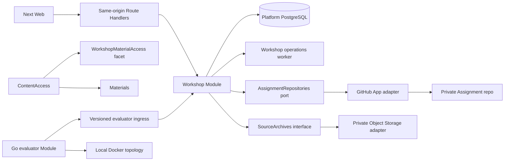

# Production Workshop v1 application specification

Статус: accepted repository-local contract для
[Platform #258](https://github.com/sachkov-inside/platform/issues/258), основанный на принятой
[Workspace specification #98](https://github.com/sachkov-inside/workspace/issues/98) и её
[tests-only amendment](https://github.com/sachkov-inside/workspace/pull/104).

Дата: 2026-09-03.

## 1. Результат и authority

Один beta Account проходит первый Production Case `Partner Webhooks` целиком: получает отдельный
Workshop access, выбирает C#/.NET или Python, получает managed private GitHub repository, запускает
локальный Go evaluator, отправляет exact pushed revision, видит `Passed` или `Needs work` по
required executable scenarios и открывает связанные Materials по принятой reveal policy.

Этот документ владеет Platform-specific application model, interfaces, states, UX contract,
security limits и candidate delivery graph. Shared product promise, общие термины и
cross-repository решения остаются в Workspace. Product brief и glossary в этом repository содержат
только Platform consequences; code, schemas, tests и будущие ADR принадлежат `platform`.

Первый slice расширяет существующий modular monolith и не создаёт новый product backend:

- TypeScript/Next/Nest Platform остаётся control plane;
- PostgreSQL хранит application state;
- существующие Account, Materials, ContentAccess и Object Storage foundations переиспользуются;
- GitHub является внешним source host за adapter seam;
- Go evaluator является отдельно собираемым Platform-owned Module, но не network service;
- participant code выполняется только на learner-controlled local machine.

## 2. Зафиксированная product boundary

### Входит

- один Workshop и один сразу доступный Middle Case `Partner Webhooks`;
- variants `.NET 10 / ASP.NET Core 10` и `Python 3.14 / FastAPI` с общей observable semantics;
- controlled time-bounded beta grant для Account с current Membership на момент выдачи;
- GitHub identity link и private Assignment repository в `sachkov-inside`;
- цельный problem context без навязанной decomposition;
- prerequisite/reference Materials, progressive hints, exact solution и alternatives;
- Go CLI, Docker-compatible public scenarios и local structured report;
- immutable Attempt для exact pushed default-branch HEAD и independently fetched source archive;
- `Passed` либо `Needs work`, unlimited later Attempts с operational limits;
- solution reveal после первой genuine Attempt либо explicit early reveal с warning;
- явный handoff в configured Telegram season/community без Platform comments или chat;
- desktop/mobile/accessibility/error-state acceptance.

### Не входит

- commercial checkout, final price, Edition, bundle или permanent-access promise;
- автоматический grant всей Membership базе;
- AI defense, AI feedback, Decision Record gate или qualitative mastery score;
- remote execution, hidden scenarios, GitHub Actions grader или participant code в Platform runtime;
- certificate, public portfolio, employer verification, leaderboard, XP или social features;
- больше одного Production Case, full core/branch graph или universal CaseSpec admin UI;
- arbitrary participant Dockerfile как общий extension contract;
- новый deployable, separate database или remote runtime repository;
- production launch/SLA и paid-product retention policy.

## 3. Complete learner journey

1. Owner выдаёт eligible Account bounded WorkshopEntitlement; Membership проверяется только при
   grant и не участвует в последующих Workshop access reads.
2. Account открывает `/workshop`, видит `Partner Webhooks`, prerequisites и честную support matrix.
3. Account связывает GitHub identity через GitHub App user authorization либо использует текущую
   подтверждённую связь.
4. Account выбирает Case Variant и один раз начинает Assignment.
5. Platform асинхронно создаёт private repository, помещает exact starter baseline, добавляет
   связанного GitHub user с `push` access и показывает invite/ready state. После диагностируемого
   failure learner явно повторяет provisioning того же Assignment, а не получает silent duplicate.
6. Learner принимает invitation, клонирует repository и запускает pinned command для своей OS.
7. Evaluator проверяет Git/Docker/environment, получает short-lived Platform session через
   device-style flow, запускает required public scenarios и отправляет bounded report.
8. Platform показывает report-ready commit SHA и текущий independently observed GitHub HEAD.
9. Learner явно нажимает «Проверить этот commit». Platform не принимает введённый вручную SHA.
10. Workshop operation fetch-ит archive exact default-branch HEAD через GitHub App, проверяет
    repository/case/variant/report binding и создаёт immutable Attempt.
11. Required scenario failure даёт `Needs work`; все required scenarios плюс exact source snapshot
    дают `Passed`.
12. После любого genuine Attempt exact solution открывается автоматически. Learner также может
    открыть его до Attempt отдельным warned action без штрафа.
13. Следующий pushed commit и новый report создают новый Attempt; прошлый не переписывается.
14. Case и Assignment surfaces дают configured handoff в Telegram season/community; Platform не
    создаёт внутренние comments, chat или обязательный Telegram step.

Ни один шаг не требует branch naming, tags, commit-message convention, ручного ввода SHA или
GitHub Actions workflow в Assignment repository.

## 4. Application modules и seams



### 4.1 Workshop Module

`apps/backend/src/modules/workshop` owns entitlements, published CaseSpec snapshots, Assignments,
evaluator authorization, accepted reports, Attempts, results, hints and solution reveals. Its
external interface is intentionally small:

- REST operations used by Web and evaluator ingress;
- one `WorkshopMaterialAccess` facet consumed by ContentAccess;
- one capability-specific worker interface for durable GitHub/source operations.

HTTP controllers call one operation each. Feature folders are navigation, not new runtime seams.
No generic repository, workflow engine, rubric engine or provider-neutral learning framework is
introduced for the one-case slice.

### 4.2 Proven internal ports

`AssignmentRepositories` is an internal port because GitHub production and deterministic test
adapters both exist. It hides installation-token creation, retries, rate limits and provider DTOs
behind cohesive operations:

- resolve one linked GitHub identity;
- provision one private repository from an immutable starter archive;
- read its default-branch HEAD;
- fetch an archive for an exact reachable commit;
- grant or revoke collaborator access;
- archive a repository during explicit cleanup.

The interface returns Platform values and typed outcomes, never Octokit responses or raw tokens.
Repository deletion is not in the first-slice interface.

`SourceArchives` is a second proven seam over the existing S3-compatible infrastructure. The
first Workshop use creates a real second consumer, so object-storage composition may move out of
the Assets Nest module without creating a generic domain entity. It stores private immutable
source bytes and returns only key, digest, byte size and retention time.

### 4.3 No false seams

- PostgreSQL remains directly available through the Workshop capability-scoped Prisma client.
- `CaseVariant` adapters are data/tooling selected by CaseSpec, not Nest providers.
- the Go CLI shares JSON Schemas and conformance fixtures, not TypeScript runtime packages;
- the existing `apps/web/src/workshop` directory is a development-only visual laboratory. New
  Production Workshop routes use owning `_pages`, `features` and `entities` slices and never
  import that directory into the production graph.

## 5. Runtime data model

Physical tables stay in the Workshop PostgreSQL schema. IDs are opaque and repository IDs are
GitHub numeric identities, not mutable owner/name strings.

| Record | Required facts and invariants |
|---|---|
| `WorkshopEntitlement` | Account, Workshop scope, `startsAt`, mandatory `validUntil`, grant source and audit actor. It is independent of Membership after issuance. |
| `WorkshopCase` | Stable case ID/slug, lifecycle and current published version pointer. First slice has exactly `partner-webhooks`. |
| `WorkshopCaseVersion` | Immutable accepted CaseSpec JSON, schema version, content digest, source repository/commit and publish/withdraw timestamps. |
| `WorkshopCaseMaterial` | Immutable link from case version to Material, role, order and release policy. It does not copy MaterialBody. |
| `GitHubConnection` | One Account to one immutable GitHub user ID plus mutable login display. GitHub user ID is unique across Accounts. No user access token is retained. |
| `Assignment` | Account, case version, variant, starter artifact/digest, GitHub repository ID, default branch, starter commit/tree and lifecycle. One active Assignment per Account/case/variant. |
| `AttemptDraft` | Short-lived evaluator authorization/report slot bound to Account, Assignment, case/variant/evaluator versions and at most one accepted report. |
| `Attempt` | Immutable identity binding Assignment, exact commit/tree, source archive digest/key, CaseSpec/evaluator/report versions and accepted report digest. |
| `AttemptScenarioResult` | One CaseSpec-declared scenario ID, required flag, status, duration and bounded diagnostic. Declared optional scenarios may be retained but never satisfy required coverage; unknown IDs reject the report. |
| `AttemptResult` | One terminal `needs_work` or `passed` result derived by Platform for one evaluated Attempt. |
| `HintReveal` | Account, case version, hint key and first reveal time. |
| `SolutionReveal` | Account, case version, first reveal time and immutable reason `after_attempt` or `learner_requested`. |

`WorkshopProgress` is derived from current entitlement, Assignment and Attempts. It is not a table
or authority for `Passed`.

### 5.1 Canonical states

| Record | States and transitions |
|---|---|
| Workshop Case | `draft → published → retired`; retired blocks new Assignments, preserves history |
| Case Version | `draft → published → withdrawn`; a published snapshot is immutable |
| Assignment | `provisioning → ready → archived`; recoverable provider failures surface as `unavailable` presentation without inventing an Assignment transition |
| Attempt Draft | `authorization_pending → authorized → report_received → consumed`; expiry is terminal and creates no Attempt |
| Attempt | `submitted → evaluated`; provider failure keeps `submitted` retryable |
| Attempt Result | terminal `needs_work` or `passed` |
| Solution Reveal | `locked → revealed`; never reverses for the same Account/case version |

One Attempt Draft creates at most one Attempt. One `(Assignment, commitSha)` creates at most one
Attempt under an idempotency constraint; a different report for an already attempted source
revision requires a new pushed commit. Retrying a source fetch or result transaction returns the
same identity.

## 6. Beta access and expiry

An owner-only release command grants beta access by Account ID and required validity interval. It
resolves current MembershipEntitlement once inside the command transaction; absence of current
Membership rejects the grant. This is cohort selection, not a new billing or admin UI.

Normal Workshop reads use only WorkshopEntitlement:

- before `startsAt` or at/after `validUntil`, new starts, evaluator authorization, submission,
  reveal and Workshop Material delivery fail closed;
- Membership expiry does not shorten an already issued beta grant;
- renewal creates or extends an explicit Workshop grant, never a Membership fallback;
- historical Attempt metadata remains, but protected content is not delivered while access is
  absent;
- expiry revokes outstanding evaluator tokens and enqueues GitHub collaborator removal; a later
  valid grant may restore collaborator access to the same Assignment after explicit learner action.

The first slice has no self-service purchase, coupon, trial or permanent entitlement.

## 7. Case authoring and publication

The public `platform` repository may contain wire schemas, generic evaluator code and synthetic
conformance fixtures, but not unreleased CaseSpec, starter sources or author solutions. After this
specification is accepted, owner creates one private Platform-owned repository
`sachkov-inside/workshop-cases`. This is a content/source lifecycle seam, not a deployable or a
second product backend. `REPOSITORIES.md` is updated when the repository actually exists.

The private repository owns:

```text
cases/partner-webhooks/
├── case.yaml
├── variants/dotnet/starter/
├── variants/python/starter/
├── evaluator/
└── solutions/
```

Runtime never reads that Git repository. An explicit owner release operation imports one exact
commit:

1. validates the pinned CaseSpec schema and content digest;
2. runs cross-variant conformance and checks required supported-host evidence;
3. validates that referenced Materials exist, are published with Workshop access and use allowed
   release policies;
4. packages each starter/evaluator artifact, hashes it and writes it to private Object Storage;
5. stores one immutable CaseVersion snapshot plus relational Material links in PostgreSQL;
6. atomically moves the stable Case current pointer only after every artifact is ready.

Failed publication leaves the previous current version unchanged. Re-running the same
source-commit/content-digest is idempotent. A changed learning outcome, starter baseline,
evaluation meaning or Material release policy requires a new case version; presentation-only typo
changes may create a new content digest under the same draft but never mutate a published snapshot.

## 8. CaseSpec and public contracts

Platform owns these versioned schemas under `contracts/workshop/`:

- `inside.workshop.case-spec.v1`;
- `inside.workshop.assignment-manifest.v1`;
- `inside.workshop.evaluation-report.v1`;
- `inside.workshop.source-snapshot.v1`.

Schema version and domain version are separate. Case/evaluator version identifiers are opaque exact
values; Platform does not infer compatibility from SemVer ranges.

CaseSpec contains identity/version, learning facts, whole-case brief, variants, starter/evaluator
artifact digests, required and optional scenario IDs, observable thresholds, supported-host
matrix, Material links and reveal policy. It contains no Platform secret, GitHub credential,
unreleased solution body or hidden scenario.

Assignment repository contains a non-secret `.inside/assignment.json` with Platform origin,
Assignment ID, case/version, variant, evaluator version and artifact digests. Editing it can only
cause a clear binding rejection; it cannot redirect Platform source authority or grant access.

Evaluation report contains exact identifiers, commit SHA, evaluator/schema versions, declared
environment, start/finish timestamps and bounded scenario outcomes. It cannot contain
`platformStatus`, entitlement, source archive, GitHub token or arbitrary raw logs. Platform derives
the aggregate result again and rejects contradictions.

## 9. GitHub identity and Assignment repositories

### 9.1 GitHub link

The GitHub App web authorization flow proves the GitHub user linked to the current Platform
Account. Backend owns App credentials and state; Next only transports the authenticated callback.
The one-time user access token is used to load immutable GitHub user ID/login and is then discarded.
State is short-lived, Account-bound and single-use. A GitHub user already linked to another Account
returns `github_identity_conflict` and only support can resolve it.

### 9.2 Provisioning

Starting the same case/variant with the same idempotency key returns the existing Assignment.
Provisioning is a durable `pg-boss` operation in `workshop-operations-worker`:

1. create private repository with an opaque assignment name;
2. upload exact starter artifact as initial `main` commit;
3. record repository ID, starter commit and starter tree;
4. add the linked GitHub user with `push` access;
5. verify visibility/default branch/collaborator outcome and mark ready.

Provider timeout is unknown, not success. Retry first reads by stored operation identity and
repository metadata before creating anything. A partial repository is adopted only if its marker
matches the Assignment; otherwise the operation stops for owner support rather than guessing.
`Retry provisioning` is an explicit authenticated mutation on the same Assignment. It is available
only after a typed `unavailable` outcome, reuses the original idempotency identity and returns to
`ready` only after the full provider read-back succeeds.

The first credentialed acceptance must prove least privilege in the real organization. The App
must not obtain administration access to unrelated Platform/Workspace repositories. If GitHub
cannot create and subsequently access assignment repositories under selected-repository scope,
the beta stops for a new owner decision; installing broad administration over all organization
repositories is not an implicit fallback.

GitHub currently limits outside-collaborator invitations, so beta cohort/rate limits must remain
below the provider limit and expose `github_invitation_limited` rather than retrying aggressively.

### 9.3 Source authority

Submission always resolves current `main` HEAD through the installation adapter. Platform requires:

- repository ID equals Assignment repository;
- HEAD is reachable in that repository and still equals the report commit;
- commit tree differs from the recorded starter tree, so no-op commits do not qualify;
- archive download succeeds for that exact SHA;
- streamed archive stays within limits and its SHA-256 is computed before persistence.

Mutable repository name/URL and learner-provided branch/SHA are never authority.
The resolved repository/commit/tree are stored when the learner confirms; a later push does not
invalidate that submitted revision while its exact archive is being fetched.

## 10. Evaluator authorization and CLI distribution

The Platform-owned Go Module lives initially under `tools/workshop-evaluator` in this repository.
CI builds native artifacts for `darwin/arm64`, `linux/amd64` and `windows/amd64`, publishes exact
checksums and keeps the evaluator version pinned in Assignment/CaseSpec. Auto-update is excluded;
the case page offers the exact compatible artifact and upgrade instruction.

The assignment wrapper provides one documented command per native shell and invokes the pinned
binary. The CLI:

1. validates manifest, Git remote, local HEAD/pushed HEAD, Docker/Compose and host support;
2. requests a device authorization from Platform and prints/opens a verification URL plus code;
3. polls until the signed-in Account approves the exact Assignment;
4. receives an opaque report token bound to one Attempt Draft, expiring within four hours;
5. downloads/verifies the public evaluator bundle by exact digest;
6. runs/cancels Compose topology and maps outcomes to schema-known diagnostics;
7. submits at most one report and removes the token from memory/local temporary files;
8. always performs bounded cleanup, including interruption and timeout paths.

Device codes expire within ten minutes, are hashed at rest and reveal no Account information.
Polling is rate-limited and follows a server-provided interval. Approval requires current Account
session, WorkshopEntitlement and Assignment ownership. Denial/expiry creates no report slot.

CLI holds no Logto cookie, GitHub App key, installation token or reusable Platform credential.
Device authorization improves safe UX and Account binding; it does not make local scenario output
trustworthy.

Go becomes an accepted application ADR only after real end-to-end runtime smoke on all three target
OS/architectures. Cross-build alone does not satisfy the gate.

## 11. Report ingestion, Attempt and result

Report ingress validates before persistence:

- exact supported schema/evaluator/case/variant versions;
- live Attempt Draft token, Account and Assignment binding;
- commit SHA syntax and current Assignment repository ID;
- unique known scenario IDs and complete required coverage;
- derived verdict consistent with scenario states;
- supported declared OS/architecture;
- body/cardinality/diagnostic limits and forbidden fields.

An accepted report consumes the report token and becomes immutable `report_received` evidence. It
does not create `Passed` and does not itself create an Attempt.

Authenticated browser confirmation creates/reuses a submitted Attempt and enqueues exact source
capture. In one final database transaction Workshop stores source provenance, scenario rows and
AttemptResult. The result rule is deliberately small:

```text
passed = exact source snapshot persisted
      && source tree differs from starter tree
      && every CaseSpec-required scenario is present and passed
```

Any accepted failed required scenario yields `needs_work`. Schema/binding/stale-source/source-fetch
failures reject or leave the submitted Attempt retryable; they are not converted into
`needs_work`, because no valid evaluated Attempt exists yet.

A retry with the same draft/idempotency key returns the same Attempt. A newly evaluated report for
an already attempted commit returns `source_revision_already_attempted`; learner pushes a new commit
before creating the next Attempt.

The UI always shows case/variant, short SHA, evaluation time, each required scenario, bounded
diagnostic and trust label «Локальные проверки». It never calls `Passed` verified authorship,
certification or independent remote verification.

## 12. Materials, hints and direct-URL protection

Material remains the only content entity. Material access class expands from `free | membership`
to `free | membership | workshop`; Workshop Materials are absent from public Library/search and
have no generic acquisition teaser.

Each immutable CaseMaterial link declares one release policy:

| Role | Release policy |
|---|---|
| prerequisite, optional reference | `immediate` while WorkshopEntitlement is current |
| hint | `hint_reveal:<key>` after explicit reveal of that hint |
| exact solution, walkthrough, alternatives/failure modes | `solution_reveal` |

ContentAccess remains the final delivery authority. For a `workshop` Material it calls the narrow
`WorkshopMaterialAccess.resolve(accountId, materialId)` facet, which reads only Platform
PostgreSQL and returns `available | locked | unavailable`; it performs no GitHub/provider call.
Direct reader URL, asset download and video authorization all use the same decision. A caller
cannot bypass reveal by knowing a Material slug or resource ID.

Explicit early solution reveal shows a non-alarmist warning that the participant is switching to
study mode. Confirmation inserts one immutable SolutionReveal with `learner_requested`. The first
genuine Attempt inserts `after_attempt` only if no earlier record exists. Reveal never changes an
AttemptResult, blocks a later Attempt or asserts unassisted work.

## 13. Web routes and presentation states

Production routes are:

- `/workshop` — access state, one-case catalog and current Assignment/last result;
- `/workshop/cases/[caseSlug]` — whole problem context, prerequisites, variants and start action;
- `/workshop/assignments/[assignmentId]` — repository, preflight, current HEAD, report/Attempt,
  diagnostics, hints, solution state and optional Telegram handoff;
- `/account` — compact GitHub link state in the existing private Account surface;
- `/workshop/evaluator/authorize` — authenticated device-code confirmation;
- exact Materials continue to use their canonical reader route.

Server-rendered reads use the existing server-only backend transport. Every interactive write uses
one named mutation through same-origin BFF: link GitHub, start Assignment, retry provisioning,
approve evaluator, confirm Attempt, reveal hint and reveal solution. No universal Workshop proxy
or browser-to-Nest address is introduced.

Required presentation states include:

- sign-in required, access required/expired and beta unavailable;
- GitHub unlinked, authorization pending, linked, conflict and revoked;
- Assignment provisioning, invitation pending, ready, unavailable with explicit retry and archived;
- unsupported host/tooling, HEAD not pushed, GitHub HEAD differs and provider unavailable;
- evaluator authorization pending/expired, running guidance and report ready;
- Attempt submitted/processing, `Needs work`, `Passed` and retryable source failure;
- hint locked/revealed and solution locked/warn/revealed.

UI reuses the accepted Platform visual world. New layout/composition still requires normal owner
desktop/mobile review, but this specification introduces no replacement visual direction.

## 14. Concurrency, idempotency and recovery

- At most one active provisioning operation exists per Assignment.
- Provisioning retry reuses the same Assignment/operation identity and first reads remote state;
  it never creates a second repository after an ambiguous provider response.
- At most one non-expired Attempt Draft exists per Assignment/Account at a time; starting another
  explicitly expires the previous draft.
- A draft accepts one report digest. Exact retry returns the receipt; different bytes are rejected.
- At most one submitted Attempt exists per draft and source commit.
- At most one source-capture job runs per Attempt; leases are retryable after worker loss.
- GitHub 404 after a previous known repository is `repository_unavailable`, not permission to
  create a replacement silently.
- Case retirement/withdrawal blocks new starts but not a report/Attempt for an already ready
  Assignment pinned to that version unless the version is explicitly security-withdrawn.
- Case publication, grant, Assignment start, reveal and Attempt confirmation require idempotency
  keys at their HTTP/command seam.

## 15. Security, privacy and limits

First-slice defaults are named policy values owned by Workshop and may be tightened without
changing result semantics:

- report body ≤ 256 KiB, at most 64 scenarios, diagnostics total ≤ 128 KiB and one message ≤ 2 KiB;
- CaseSpec ≤ 1 MiB;
- source archive ≤ 50 MiB compressed and 200 MiB expanded; archive paths are normalized and
  traversal/special files rejected before durable storage;
- one in-flight Attempt per Assignment and a 30-second confirmation cooldown;
- device approval code ≤ 10 minutes; report token ≤ 4 hours and single-use;
- source archive bytes retained 30 days in closed beta, then deleted; digest/provenance and
  AttemptResult remain until Account data deletion policy exists;
- Assignment repositories remain private through beta and are archived/removed only by explicit
  owner cleanup; no permanent-access promise is made.

Object Storage uses a dedicated private source bucket/prefix and server-side encryption. Source
archives never receive presigned learner URLs, enter logs or flow into participant containers.
Known secret-looking values are redacted from diagnostics; raw Compose logs remain local. UI warns
the learner not to commit work or personal secrets. Platform/GitHub credentials never enter the
Assignment repository, evaluator bundle, report or source archive.

GitHub App minimum intended permissions are `Administration: write` for managed repository and
collaborator operations, `Contents: read/write` for starter/source, and `Metadata: read`; exact
permission viability must be proven against selected repositories before beta. Every installation
token is minted just in time and expires at the provider boundary.

## 16. Partner Webhooks conformance

Both variants implement the same public observable contract without prescribing outbox, queue,
worker layout or retry algorithm:

- order API never waits for the partner endpoint and responds within the declared 250 ms ceiling;
- a burst of 100 events over five seconds drains within the declared window;
- at most eight concurrent partner calls occur;
- retryable outcomes cover `429`, selected `5xx`, connect timeout and read timeout;
- selected permanent `4xx` become terminal and diagnosable;
- `503 → retry → 204` loses no event;
- tenant endpoint/secret/delivery data are isolated;
- webhook authenticates exact raw payload with timestamped HMAC-SHA256;
- invalid signature is terminal and secrets/sensitive payload are absent from logs;
- restart/crash and duplicate-delivery fixtures prove the promised delivery semantics.

The accepted prototype numbers are calibration inputs, not permission to ship only one happy-path
fixture. Each requirement above must have a common conformance scenario or be removed from the
learner promise. C# and Python author solutions may be idiomatic but must pass the same scenario IDs
and thresholds on all supported hosts.

## 17. Operational behavior and observability

`workshop-operations-worker` is justified by the first durable provisioning/source/revocation job
and remains another entrypoint of the existing backend codebase. It exports no network interface.

Metrics/logs use opaque IDs and reason codes:

- assignment provisioning duration/outcome and GitHub rate-limit state;
- device authorization and report rejection codes;
- source fetch bytes/duration/outcome;
- Attempt result counts by case/variant/evaluator/host, never by source content;
- early/post-attempt reveal, hints and repeated-Attempt patterns;
- stale/incompatible clients and support-required partial provisioning.

Logs exclude authorization codes, tokens, repository clone URLs with credentials, source bytes,
raw diagnostics and Material bodies. Readiness reports database, object storage and job wiring; a
GitHub outage degrades Workshop operations but does not make Materials/Account runtime globally
unready.

## 18. Architecture fitness and verification

| Rule | Closest executable proof |
|---|---|
| Workshop access is independent after grant | PostgreSQL integration matrix grants from current Membership, then changes Membership and proves access follows only WorkshopEntitlement; negative fixture with Membership alone is denied |
| Workshop Material cannot bypass reveal | ContentAccess matrix covers direct body, asset and video routes before/after hint/solution reveal |
| Local report cannot assign status | Schema/ingress negative fixture adds `platformStatus` and must fail |
| `Passed` needs report plus exact source | integration cases reject missing/failed scenarios, foreign repo, stale SHA, unchanged tree and absent archive |
| Provider DTOs/tokens stay behind GitHub seam | deterministic adapter corpus plus import/architecture guardrail |
| Contracts match TypeScript and Go | identical valid/invalid JSON corpus runs in backend and CLI checks |
| Go supports the beta matrix | real runtime E2E smoke on macOS arm64, Linux amd64 and Windows amd64, not cross-build |
| Participant code never reaches Platform runtime | compose/dependency guardrail proves no evaluator/assignment execution path from API/worker |
| Production Web avoids visual-lab imports | existing web architecture check gets a failing negative fixture for `src/workshop` import |

Every implementation PR runs focused tests, `pnpm docs:check`, relevant API/schema generation,
root `pnpm check`, Standards review and Spec review. Persistence/concurrency work also runs real
PostgreSQL integration tests; browser/backend contract work runs full-stack Playwright. UI tickets
provide Storybook plus desktop/mobile evidence and owner review.

## 19. Candidate delivery graph

Implementation issues are created only after owner acceptance of this specification and this
decomposition. Candidate lanes are intentionally vertical:

| Lane | Observable result | Dependencies | Stopping condition |
|---|---|---|---|
| A. Workshop foundation and protected Materials | Enabling: grant, immutable CaseSpec publication mechanics and direct-URL reveal policy work through a synthetic fixture | — | grant/publication idempotency plus ContentAccess/reveal matrix pass; converges in E/F |
| B. GitHub link and managed Assignment | Enabling: linked Account provisions one fixture Assignment and can explicitly recover a failed operation | A | credentialed least-privilege proof, idempotent provisioning and failure recovery pass; converges in E/F |
| C. Versioned contracts and Go evaluator | Enabling: pinned CLI performs preflight/public scenarios and submits a bound report on three real supported hosts | — | shared corpus plus macOS/Linux/Windows runtime evidence pass; owner may accept Go ADR; converges in E/F |
| D. Partner Webhooks variant parity | Enabling: C# and Python starter/author solutions pass the same complete observable conformance corpus | C | private case-source candidate validates both variants and all declared scenarios; converges in E/F |
| E. Published Case, exact-source Attempt and result/reveal | User-visible: eligible learner opens the real Case, provisions either variant, confirms current pushed commit, gets `Needs work`/`Passed`, reveals solution and retries | A, B, C, D | actual Case publication plus positive/negative Attempt journey and immutable source retention path pass |
| F. Aggregate beta acceptance | User-visible: one beta Account completes the full journey and optional Telegram handoff without manual repository repair | E | desktop/mobile/a11y evidence, provider smoke, support/metrics read-back and owner acceptance pass |

Enabling lanes B–D name E/F as their convergence. They must not claim the Workshop is delivered
alone. No horizontal tickets for generic database, generic GitHub wrapper or generic UI system are
created.

## 20. Owner gates and ADR triggers

Owner approval is required for:

- accepting and merging this specification;
- the candidate delivery decomposition before child issues are created;
- creating the private `workshop-cases` repository and recording it in Workspace ownership docs;
- GitHub App registration/install permissions, organization test repositories and invitations;
- accepting the Go ADR after three real-host smokes;
- each implementation PR merge and final desktop/mobile result;
- beta Account grants, actual source retention changes and live beta opening.

No ADR is created by this specification. A Go ADR is premature until the runtime matrix passes.
The private case-source repository is a reversible content/security placement documented here and
in `REPOSITORIES.md` when created; it does not require an application ADR unless its lifecycle later
diverges from Platform ownership.

## 21. Aggregate acceptance and stopping condition

The first slice is complete only when one real beta Account, without manual correction of branch or
repository state:

1. receives a bounded grant and opens the Case;
2. links GitHub and provisions either variant;
3. clones and passes environment preflight on a supported host;
4. produces at least one failing genuine Attempt and sees actionable `Needs work`;
5. reveals the exact solution after Attempt or exercises explicit early reveal in a separate test;
6. pushes a corrected commit and receives `Passed` for exact independently archived source;
7. can still inspect immutable prior Attempt history;
8. cannot bypass access, reveal, repository or report bindings in the full negative matrix.

Specification #258 remains the native delivery parent until accepted child lanes close completed,
all repository verification/reviews pass and owner accepts the aggregate desktop/mobile journey.

## 22. External references

- [GitHub: create an organization repository](https://docs.github.com/en/rest/repos/repos#create-an-organization-repository)
- [GitHub: add a repository collaborator](https://docs.github.com/en/rest/collaborators/collaborators#add-a-repository-collaborator)
- [GitHub: download a repository archive](https://docs.github.com/en/rest/repos/contents#download-a-repository-archive-tar)
- [GitHub App user authorization](https://docs.github.com/en/apps/maintaining-github-apps/modifying-a-github-app-registration#requesting-user-authorization-oauth-during-installation)
- [GitHub App installation access tokens](https://docs.github.com/en/rest/apps/apps#create-an-installation-access-token-for-an-app)
